# Existential Isolation and Precarious Manhood

### This project seeks to examine whether normative conceptions of masculinity are the underlying mechanism of the finding that men tend to experience more existential isolation (EI) than women. Existential isolation is the feeling of being subjctively alone in one's experiences. For example, not laughing at a joke that a group of people you're with would be an existentially isolating experience. Everyone experiences EI to some degree or another, but for those who are more existentially isolated, two fundamental human needs are stymied: the need to know and the need to belong. Thus, for some, EI is psychologically damaging and can have negative donwstream outcomes such as loneliness, depression, and anxiety.


### In the West, men consistently report more EI than women. Previous research has suggested that this is driven largely by men's relatively lower endorsement of communal values. That is, men, compared to women, tend to report that they value communality less, and this in turn predicts men's endorsement of EI. However, in a previous study, we attempted to replicate these findings, and found that it was not communal norms that differentiated men and women, but rather a mismatch between participants' self-reported precariousness manhood (PM) beliefs and the extent to which they believed society endorsed PM. Precarious manhood is the idea that manhood, compared to womanhood, is a tenuous, desirable status that must be earned, is socially conferred, and can easily be lost. In our previous study, men who did not endorse PM beliefs but believed they were prevalent in American society were significantly higher in EI than those who endorsed PM beliefs or those who did not believe they were societally prevalent.


### This study is a follow-up to attempt to replicate our previous findings and determine if it is in fact the disconnect between self-endorsed PM and beliefs about others PM that drives EI, or whether there is a simpler explanation: that generalized false consensus beliefs account for men's EI. Over the course of 3 semesters, we sampled 291 college students on a variety of scales, including EI, PM self beliefs, PM beliefs among close friends/family, PM beliefs in society, conformity to masculine norms, communality, interdependence, loneliness, and aggression.


### **False Consensus Items***


1. I have no fear of spiders.
2. I think that I would like the kind of work that a forest ranger does.
3. I think most people would lie to get ahead.
4. Criticism or scolding hurts me terribly.


### **Normality Checks**

### There is a bit of non-normality at the higher end of EI, but it doesn't appear that bad.


```r
ggpubr::ggqqplot(clean_data$EI) +
  ylab("EI")
```

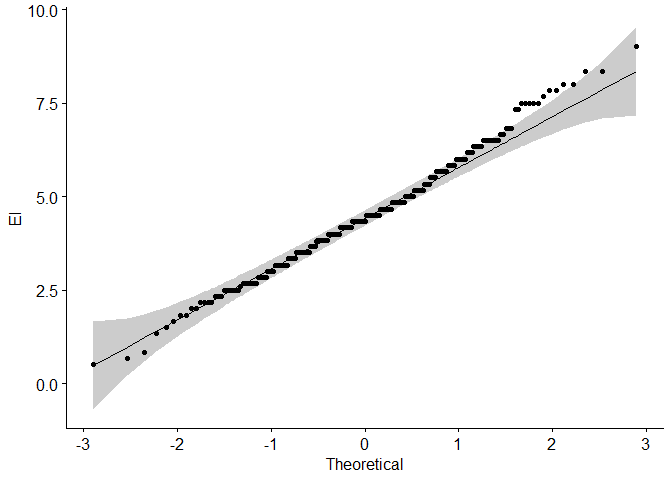<!-- -->

```r
ggpubr::ggqqplot(clean_data$PMSelf) +
  ylab("PM - Self")
```

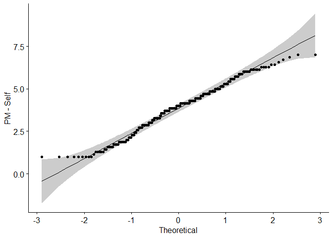<!-- -->

```r
ggpubr::ggqqplot(clean_data$PMClose) +
  ylab("PM - Close")
```

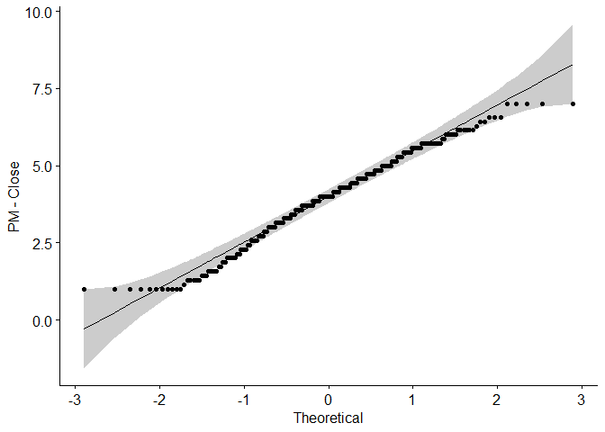<!-- -->

```r
ggpubr::ggqqplot(clean_data$PMSoc) +
  ylab("PM - Society")
```

<!-- -->

```r
ggpubr::ggqqplot(clean_data$FalseCons) +
  ylab("False Consensus")
```

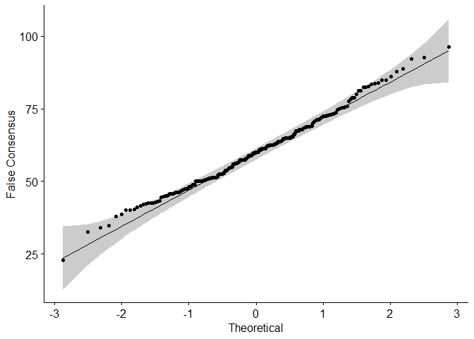<!-- -->

### **Histograms and Descriptives**

### First, we'll examine the histograms of our variables of interest. I wrote a function for the histograms instead of rewriting the code for each plot. Precarious manhood - self and PM - close others mirror each other in terms of distributions, whereas PM- society is slightly skewed. No values are outside the expected range.


```r
hist_funct <- function(.dat, variable, xlabel) {
  plot_out <- .dat %>% 
    filter(sex == 1 & attnchk1 == 5) %>% 
    ggplot() +
    aes(x = {{variable}}) +
    geom_histogram(aes(y = ..density..),
                   color = "black", 
                   fill = "white") +
    geom_density(alpha = 0.2, fill = "#FF6666") +
    xlab(xlabel)
  
  return(plot_out)
}

h1 <- hist_funct(data, EI, "Existential Isolation")
h2 <- hist_funct(data, PMSelf, "PM - Self")
h3 <- hist_funct(data, PMClose, "PM - Close Others")
h4 <- hist_funct(data, PMSoc, "PM - Society")
h5 <- hist_funct(data, cmni, "Conformity to\n Masculine Norms")
h6 <- hist_funct(data, communal, "Communality")
h7 <- hist_funct(data, interd, "Interdependence")
h8 <- hist_funct(data, lonely, "Loneliness")
h9 <- hist_funct(data, agg, "Aggression")
h10 <- hist_funct(data, FalseCons, "False Consensus")


wrap_plots(h1, h2, h3, h4, h5, h6, h7, h8, h9, h10)
```

<!-- -->


```r
variables <- c("EI", "PMSelf", "PMClose", "PMSoc", "cmni", "communal", "interd", "lonely", "agg", "FalseCons")

tab1 <- data %>% 
  filter(sex == 1 & attnchk1 == 5) %>%
  summarize(across(all_of(variables), 
                   list(Mean = mean, 
                        SD = sd,
                        Median = median,
                        Min = min,
                        Max = max), 
                   na.rm = TRUE)) %>% 
  pivot_longer(cols = everything(), 
               names_to = c("Scale", ".value"), 
               names_sep = "_")

tab1 %>% 
  kbl(digits = 2,
      caption = "Descriptive Statistics") %>%
  kable_paper(font_size = 20,
              bootstrap_options = c("striped", "responsive"))
```

<table class=" lightable-paper" style='font-size: 20px; font-family: "Arial Narrow", arial, helvetica, sans-serif; margin-left: auto; margin-right: auto;'>
<caption style="font-size: initial !important;">Descriptive Statistics</caption>
 <thead>
  <tr>
   <th style="text-align:left;"> Scale </th>
   <th style="text-align:right;"> Mean </th>
   <th style="text-align:right;"> SD </th>
   <th style="text-align:right;"> Median </th>
   <th style="text-align:right;"> Min </th>
   <th style="text-align:right;"> Max </th>
  </tr>
 </thead>
<tbody>
  <tr>
   <td style="text-align:left;"> EI </td>
   <td style="text-align:right;"> 4.48 </td>
   <td style="text-align:right;"> 1.49 </td>
   <td style="text-align:right;"> 4.33 </td>
   <td style="text-align:right;"> 0.50 </td>
   <td style="text-align:right;"> 9.00 </td>
  </tr>
  <tr>
   <td style="text-align:left;"> PMSelf </td>
   <td style="text-align:right;"> 3.87 </td>
   <td style="text-align:right;"> 1.42 </td>
   <td style="text-align:right;"> 4.00 </td>
   <td style="text-align:right;"> 1.00 </td>
   <td style="text-align:right;"> 7.00 </td>
  </tr>
  <tr>
   <td style="text-align:left;"> PMClose </td>
   <td style="text-align:right;"> 3.94 </td>
   <td style="text-align:right;"> 1.47 </td>
   <td style="text-align:right;"> 4.00 </td>
   <td style="text-align:right;"> 1.00 </td>
   <td style="text-align:right;"> 7.00 </td>
  </tr>
  <tr>
   <td style="text-align:left;"> PMSoc </td>
   <td style="text-align:right;"> 4.77 </td>
   <td style="text-align:right;"> 1.19 </td>
   <td style="text-align:right;"> 4.86 </td>
   <td style="text-align:right;"> 1.00 </td>
   <td style="text-align:right;"> 7.00 </td>
  </tr>
  <tr>
   <td style="text-align:left;"> cmni </td>
   <td style="text-align:right;"> 2.29 </td>
   <td style="text-align:right;"> 0.34 </td>
   <td style="text-align:right;"> 2.30 </td>
   <td style="text-align:right;"> 1.43 </td>
   <td style="text-align:right;"> 3.48 </td>
  </tr>
  <tr>
   <td style="text-align:left;"> communal </td>
   <td style="text-align:right;"> 7.20 </td>
   <td style="text-align:right;"> 1.17 </td>
   <td style="text-align:right;"> 7.21 </td>
   <td style="text-align:right;"> 3.92 </td>
   <td style="text-align:right;"> 9.00 </td>
  </tr>
  <tr>
   <td style="text-align:left;"> interd </td>
   <td style="text-align:right;"> 4.77 </td>
   <td style="text-align:right;"> 0.87 </td>
   <td style="text-align:right;"> 4.75 </td>
   <td style="text-align:right;"> 1.58 </td>
   <td style="text-align:right;"> 7.00 </td>
  </tr>
  <tr>
   <td style="text-align:left;"> lonely </td>
   <td style="text-align:right;"> 0.96 </td>
   <td style="text-align:right;"> 0.52 </td>
   <td style="text-align:right;"> 0.93 </td>
   <td style="text-align:right;"> 0.00 </td>
   <td style="text-align:right;"> 2.67 </td>
  </tr>
  <tr>
   <td style="text-align:left;"> agg </td>
   <td style="text-align:right;"> 3.22 </td>
   <td style="text-align:right;"> 0.93 </td>
   <td style="text-align:right;"> 3.18 </td>
   <td style="text-align:right;"> 1.24 </td>
   <td style="text-align:right;"> 6.00 </td>
  </tr>
  <tr>
   <td style="text-align:left;"> FalseCons </td>
   <td style="text-align:right;"> 60.12 </td>
   <td style="text-align:right;"> 12.15 </td>
   <td style="text-align:right;"> 60.00 </td>
   <td style="text-align:right;"> 23.00 </td>
   <td style="text-align:right;"> 96.25 </td>
  </tr>
</tbody>
</table>

### **Boxplots**

### Again, I wrote a function for the univariate boxplots, just to see what the outlier situation was like. There are a few outliers in EI, interdependence, loneliness, and aggeression.


```r
uni_boxplot_funct <- function(.dat, variable){
  plot_out <- .dat %>% 
    filter(sex ==1 & attnchk1 == 5) %>% 
    ggplot() +
    aes(x = "", y = {{variable}}) +
    geom_boxplot(color = "black",
                 alpha = .5,
                 width = .1,
                 size = .5) +
    theme(axis.title.x = element_blank())
  
  return(plot_out)
}

bp1 <- uni_boxplot_funct(data, EI)
bp2 <- uni_boxplot_funct(data, PMSelf)
bp3 <- uni_boxplot_funct(data, PMClose)
bp4 <- uni_boxplot_funct(data, PMSoc)
bp5 <- uni_boxplot_funct(data, cmni)
bp6 <- uni_boxplot_funct(data, communal)
bp7 <- uni_boxplot_funct(data, interd)
bp8 <- uni_boxplot_funct(data, lonely)
bp9 <- uni_boxplot_funct(data, agg)
b10 <- uni_boxplot_funct(data, FalseCons)


bp1+bp2+bp3+bp4+bp5+bp6+bp7+bp8+bp9+b10
```

<!-- -->

### Outliers

### Next, I'll remove multivariate outliers from our variables of interest. This reduces the sample size from 264 to 225.


```r
outlier_data <- clean_data %>% 
  select(c("PMSelf", "PMClose", "FalseCons", "EI", "PMSoc", "lonely"))

outlier_data <- outlier_data %>% 
  filter(!(is.na(PMSelf))) %>% 
  filter(!(is.na(PMClose))) %>% 
  filter(!(is.na(FalseCons))) %>% 
  filter(!(is.na(EI))) %>% 
  filter(!(is.na(PMSoc))) %>%
  filter(!(is.na(lonely))) %>%
  as.data.frame()

PM_out <- aq.plot(outlier_data)
```

```
## Projection to the first and second robust principal components.
## Proportion of total variation (explained variance): 0.7978973
```

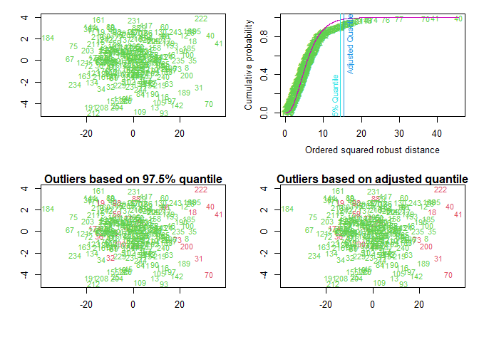<!-- -->

```r
out_data <- cbind(outlier_data, PM_out$outliers)

out_data <- out_data %>% 
  filter(PM_out$outliers == FALSE)
```


### **Reliability**

### Reliability is good for all scales except for the false consensus items, which is rather low. I'll continue using them for these analyses but will go back and see if there's anything I can do to adjust this.


```
## 
## Reliability analysis   
## Call: psych::alpha(x = EI)
## 
##   raw_alpha std.alpha G6(smc) average_r S/N   ase mean  sd median_r
##       0.78      0.79    0.78      0.38 3.7 0.021  4.5 1.5     0.43
## 
##  lower alpha upper     95% confidence boundaries
## 0.74 0.78 0.82 
## 
##  Reliability if an item is dropped:
##      raw_alpha std.alpha G6(smc) average_r S/N alpha se var.r med.r
## EI1r      0.73      0.74    0.72      0.36 2.8    0.026 0.021  0.40
## EI2r      0.75      0.76    0.75      0.38 3.1    0.024 0.023  0.42
## EI3r      0.74      0.74    0.72      0.36 2.8    0.026 0.019  0.42
## EI4       0.74      0.75    0.73      0.37 3.0    0.025 0.030  0.44
## EI5       0.81      0.81    0.78      0.46 4.2    0.019 0.006  0.45
## EI6r      0.73      0.73    0.72      0.36 2.8    0.026 0.018  0.39
## 
##  Item statistics 
##        n raw.r std.r r.cor r.drop mean  sd
## EI1r 262  0.75  0.75  0.70   0.61  4.6 2.1
## EI2r 263  0.68  0.69  0.60   0.52  4.4 2.1
## EI3r 263  0.74  0.74  0.68   0.59  4.3 2.1
## EI4  262  0.73  0.72  0.64   0.57  4.6 2.3
## EI5  263  0.53  0.51  0.36   0.31  4.6 2.3
## EI6r 263  0.75  0.76  0.71   0.62  4.4 2.0
```

```
## 
## Reliability analysis   
## Call: psych::alpha(x = PMSelf)
## 
##   raw_alpha std.alpha G6(smc) average_r S/N   ase mean  sd median_r
##       0.87      0.87    0.87      0.48 6.4 0.012  3.9 1.4     0.44
## 
##  lower alpha upper     95% confidence boundaries
## 0.84 0.87 0.89 
## 
##  Reliability if an item is dropped:
##         raw_alpha std.alpha G6(smc) average_r S/N alpha se var.r med.r
## PMSelf1      0.84      0.84    0.83      0.46 5.1    0.015 0.024  0.44
## PMSelf2      0.87      0.87    0.87      0.52 6.5    0.012 0.022  0.55
## PMSelf3      0.85      0.85    0.85      0.49 5.7    0.014 0.025  0.44
## PMSelf4      0.87      0.88    0.87      0.54 7.0    0.012 0.017  0.55
## PMSelf5      0.84      0.83    0.83      0.46 5.0    0.015 0.020  0.43
## PMSelf6      0.83      0.82    0.82      0.44 4.7    0.016 0.016  0.43
## PMSelf7      0.84      0.83    0.83      0.46 5.0    0.015 0.024  0.44
## 
##  Item statistics 
##           n raw.r std.r r.cor r.drop mean  sd
## PMSelf1 264  0.80  0.80  0.78   0.72  3.5 1.9
## PMSelf2 264  0.63  0.63  0.52   0.49  3.9 1.9
## PMSelf3 263  0.72  0.72  0.66   0.60  4.3 2.0
## PMSelf4 264  0.56  0.57  0.45   0.42  4.5 1.7
## PMSelf5 263  0.81  0.81  0.80   0.73  3.3 1.9
## PMSelf6 264  0.86  0.86  0.86   0.80  3.7 2.0
## PMSelf7 264  0.82  0.81  0.79   0.73  3.9 1.9
## 
## Non missing response frequency for each item
##            1    2    3    4    5    6    7 miss
## PMSelf1 0.22 0.11 0.16 0.20 0.14 0.09 0.07    0
## PMSelf2 0.20 0.08 0.11 0.17 0.23 0.10 0.10    0
## PMSelf3 0.16 0.08 0.10 0.16 0.21 0.10 0.19    0
## PMSelf4 0.09 0.04 0.13 0.19 0.28 0.12 0.15    0
## PMSelf5 0.29 0.10 0.16 0.16 0.17 0.06 0.06    0
## PMSelf6 0.20 0.12 0.13 0.15 0.21 0.09 0.10    0
## PMSelf7 0.19 0.08 0.11 0.18 0.22 0.12 0.10    0
```

```
## 
## Reliability analysis   
## Call: psych::alpha(x = PMClose)
## 
##   raw_alpha std.alpha G6(smc) average_r S/N    ase mean  sd median_r
##       0.91      0.91     0.9      0.58 9.8 0.0087  3.9 1.5     0.59
## 
##  lower alpha upper     95% confidence boundaries
## 0.89 0.91 0.92 
## 
##  Reliability if an item is dropped:
##          raw_alpha std.alpha G6(smc) average_r S/N alpha se  var.r med.r
## PMClose1      0.89      0.89    0.88      0.57 8.1   0.0106 0.0068  0.59
## PMClose2      0.90      0.90    0.89      0.60 8.9   0.0097 0.0059  0.61
## PMClose3      0.90      0.90    0.89      0.60 9.1   0.0095 0.0045  0.60
## PMClose4      0.90      0.90    0.89      0.60 9.2   0.0094 0.0059  0.61
## PMClose5      0.89      0.89    0.88      0.58 8.4   0.0102 0.0057  0.60
## PMClose6      0.88      0.88    0.87      0.56 7.6   0.0112 0.0048  0.57
## PMClose7      0.89      0.89    0.88      0.57 8.0   0.0106 0.0063  0.59
## 
##  Item statistics 
##            n raw.r std.r r.cor r.drop mean  sd
## PMClose1 263  0.83  0.83  0.80   0.76  3.7 1.8
## PMClose2 263  0.76  0.77  0.71   0.67  4.1 1.8
## PMClose3 263  0.76  0.76  0.70   0.66  4.4 1.9
## PMClose4 262  0.75  0.75  0.68   0.65  3.6 1.9
## PMClose5 262  0.81  0.81  0.77   0.73  3.7 1.9
## PMClose6 263  0.87  0.87  0.86   0.82  4.0 1.8
## PMClose7 263  0.83  0.83  0.81   0.76  4.1 1.8
## 
## Non missing response frequency for each item
##             1    2    3    4    5    6    7 miss
## PMClose1 0.16 0.11 0.19 0.21 0.15 0.10 0.08 0.00
## PMClose2 0.14 0.09 0.08 0.25 0.22 0.14 0.08 0.00
## PMClose3 0.11 0.07 0.12 0.19 0.21 0.16 0.15 0.00
## PMClose4 0.19 0.11 0.15 0.22 0.15 0.10 0.08 0.01
## PMClose5 0.18 0.11 0.15 0.21 0.13 0.15 0.06 0.01
## PMClose6 0.15 0.09 0.12 0.22 0.19 0.15 0.08 0.00
## PMClose7 0.12 0.09 0.14 0.22 0.19 0.13 0.11 0.00
```

```
## 
## Reliability analysis   
## Call: psych::alpha(x = false_consens)
## 
##   raw_alpha std.alpha G6(smc) average_r  S/N   ase mean sd median_r
##       0.21      0.21    0.18     0.063 0.27 0.079   60 12    0.068
## 
##  lower alpha upper     95% confidence boundaries
## 0.06 0.21 0.37 
## 
##  Reliability if an item is dropped:
##            raw_alpha std.alpha G6(smc) average_r  S/N alpha se  var.r  med.r
## FC1_Cons_1      0.12     0.133   0.103     0.049 0.15    0.094 0.0079  0.037
## FC2_Cons_1      0.18     0.189   0.145     0.072 0.23    0.087 0.0077  0.100
## FC3_Cons_1      0.25     0.246   0.184     0.098 0.33    0.079 0.0037  0.100
## FC4_Cons_1      0.11     0.092   0.078     0.033 0.10    0.093 0.0118 -0.026
## 
##  Item statistics 
##              n raw.r std.r r.cor r.drop mean sd
## FC1_Cons_1 255  0.61  0.56  0.29  0.134   56 24
## FC2_Cons_1 255  0.57  0.53  0.20  0.096   57 23
## FC3_Cons_1 256  0.45  0.50  0.11  0.036   70 20
## FC4_Cons_1 252  0.55  0.59  0.33  0.151   57 21
```

```
## 
## Reliability analysis   
## Call: psych::alpha(x = PMSoc)
## 
##   raw_alpha std.alpha G6(smc) average_r S/N   ase mean  sd median_r
##       0.89      0.89    0.88      0.53 7.8 0.011  4.8 1.2     0.51
## 
##  lower alpha upper     95% confidence boundaries
## 0.87 0.89 0.91 
## 
##  Reliability if an item is dropped:
##        raw_alpha std.alpha G6(smc) average_r S/N alpha se  var.r med.r
## PMSoc1      0.87      0.87    0.86      0.53 6.7    0.012 0.0084  0.51
## PMSoc2      0.88      0.88    0.87      0.55 7.4    0.011 0.0086  0.51
## PMSoc3      0.88      0.88    0.87      0.55 7.2    0.012 0.0083  0.51
## PMSoc4      0.88      0.88    0.87      0.55 7.3    0.012 0.0096  0.51
## PMSoc5      0.86      0.86    0.85      0.51 6.1    0.013 0.0059  0.49
## PMSoc6      0.86      0.86    0.85      0.51 6.3    0.013 0.0057  0.50
## PMSoc7      0.86      0.86    0.85      0.51 6.2    0.013 0.0077  0.49
## 
##  Item statistics 
##          n raw.r std.r r.cor r.drop mean  sd
## PMSoc1 263  0.78  0.77  0.73   0.68  4.4 1.6
## PMSoc2 262  0.70  0.70  0.62   0.59  5.1 1.5
## PMSoc3 263  0.73  0.73  0.66   0.62  4.8 1.6
## PMSoc4 263  0.71  0.72  0.64   0.61  4.9 1.5
## PMSoc5 263  0.84  0.84  0.82   0.76  4.7 1.6
## PMSoc6 263  0.82  0.82  0.80   0.75  4.7 1.5
## PMSoc7 263  0.83  0.83  0.80   0.76  4.8 1.6
## 
## Non missing response frequency for each item
##           1    2    3    4    5    6    7 miss
## PMSoc1 0.06 0.06 0.14 0.24 0.26 0.13 0.11 0.00
## PMSoc2 0.02 0.05 0.06 0.19 0.25 0.24 0.19 0.01
## PMSoc3 0.04 0.06 0.12 0.16 0.29 0.17 0.17 0.00
## PMSoc4 0.02 0.03 0.13 0.19 0.28 0.18 0.17 0.00
## PMSoc5 0.04 0.07 0.10 0.19 0.30 0.17 0.13 0.00
## PMSoc6 0.03 0.05 0.10 0.21 0.32 0.16 0.12 0.00
## PMSoc7 0.03 0.06 0.09 0.20 0.28 0.17 0.17 0.00
```

```
## 
## Reliability analysis   
## Call: psych::alpha(x = cmni)
## 
##   raw_alpha std.alpha G6(smc) average_r S/N   ase mean   sd median_r
##       0.86      0.86    0.93      0.12   6 0.013  2.3 0.34    0.088
## 
##  lower alpha upper     95% confidence boundaries
## 0.83 0.86 0.88 
## 
##  Reliability if an item is dropped:
##         raw_alpha std.alpha G6(smc) average_r S/N alpha se var.r med.r
## CMNI1        0.85      0.85    0.93      0.11 5.7    0.013 0.025 0.086
## CMNI2        0.86      0.86    0.93      0.12 5.9    0.013 0.025 0.089
## CMNI3        0.85      0.85    0.92      0.11 5.7    0.013 0.025 0.086
## CMNI8        0.85      0.85    0.92      0.11 5.8    0.013 0.025 0.087
## CMNI11       0.85      0.85    0.93      0.12 5.9    0.013 0.025 0.088
## CMNI14       0.85      0.85    0.93      0.11 5.8    0.013 0.025 0.087
## CMNI16       0.85      0.85    0.93      0.11 5.8    0.013 0.025 0.088
## CMNI18       0.85      0.85    0.93      0.11 5.8    0.013 0.025 0.087
## CMNI19       0.86      0.86    0.93      0.12 5.9    0.013 0.025 0.088
## CMNI20       0.86      0.85    0.93      0.12 5.9    0.013 0.026 0.088
## CMNI21       0.86      0.85    0.93      0.12 5.9    0.013 0.025 0.089
## CMNI22       0.85      0.85    0.93      0.11 5.8    0.013 0.025 0.087
## CMNI24       0.85      0.85    0.92      0.11 5.7    0.013 0.025 0.085
## CMNI26       0.85      0.85    0.93      0.11 5.8    0.013 0.025 0.088
## CMNI28       0.85      0.85    0.93      0.11 5.8    0.013 0.025 0.087
## CMNI29       0.86      0.85    0.93      0.12 5.9    0.013 0.026 0.089
## CMNI30       0.85      0.85    0.93      0.12 5.9    0.013 0.025 0.089
## CMNI31       0.86      0.86    0.93      0.12 6.0    0.013 0.025 0.089
## CMNI32       0.85      0.85    0.93      0.11 5.8    0.013 0.025 0.089
## CMNI35       0.85      0.85    0.93      0.11 5.7    0.013 0.025 0.084
## CMNI36       0.86      0.86    0.93      0.12 6.0    0.013 0.025 0.090
## CMNI37       0.85      0.85    0.93      0.11 5.8    0.013 0.025 0.087
## CMNI39       0.86      0.86    0.93      0.12 5.9    0.013 0.025 0.089
## CMNI42       0.85      0.85    0.93      0.11 5.8    0.013 0.026 0.087
## CMNI43       0.85      0.85    0.92      0.11 5.7    0.013 0.025 0.086
## CMNI44       0.85      0.85    0.93      0.12 5.9    0.013 0.025 0.089
## CMNI45       0.85      0.85    0.93      0.11 5.7    0.013 0.025 0.086
## CMNI46       0.85      0.85    0.93      0.11 5.8    0.013 0.025 0.087
## CMNI4r       0.85      0.85    0.93      0.12 5.9    0.013 0.025 0.088
## CMNI5r       0.85      0.85    0.93      0.11 5.8    0.013 0.025 0.087
## CMNI6r       0.86      0.86    0.93      0.12 6.0    0.013 0.025 0.089
## CMNI7r       0.85      0.85    0.93      0.11 5.8    0.013 0.025 0.086
## CMNI9r       0.86      0.86    0.93      0.12 5.9    0.013 0.025 0.089
## CMNI10r      0.86      0.86    0.93      0.12 5.9    0.013 0.025 0.089
## CMNI12r      0.86      0.86    0.93      0.12 6.0    0.013 0.026 0.090
## CMNI13r      0.85      0.85    0.93      0.12 5.9    0.013 0.025 0.089
## CMNI15r      0.85      0.85    0.93      0.11 5.8    0.013 0.025 0.087
## CMNI17r      0.85      0.85    0.92      0.11 5.8    0.013 0.025 0.087
## CMNI23r      0.86      0.86    0.93      0.12 6.2    0.012 0.025 0.091
## CMNI25r      0.85      0.85    0.93      0.11 5.8    0.013 0.025 0.089
## CMNI27r      0.85      0.85    0.93      0.12 5.9    0.013 0.025 0.089
## CMNI33r      0.85      0.85    0.93      0.11 5.8    0.013 0.025 0.086
## CMNI34r      0.86      0.86    0.93      0.12 5.9    0.013 0.025 0.089
## CMNI38r      0.85      0.85    0.93      0.12 5.9    0.013 0.025 0.090
## CMNI40r      0.85      0.85    0.93      0.12 5.9    0.013 0.025 0.089
## CMNI41r      0.86      0.86    0.93      0.12 6.0    0.013 0.025 0.089
## 
##  Item statistics 
##           n raw.r std.r r.cor  r.drop mean   sd
## CMNI1   263 0.476 0.476 0.465  0.4295  2.1 0.91
## CMNI2   264 0.306 0.318 0.305  0.2549  1.6 0.85
## CMNI3   264 0.475 0.478 0.480  0.4222  2.4 1.00
## CMNI8   263 0.416 0.425 0.423  0.3648  2.5 0.93
## CMNI11  263 0.350 0.350 0.332  0.2961  2.0 0.91
## CMNI14  264 0.480 0.465 0.459  0.4282  1.8 0.98
## CMNI16  264 0.377 0.385 0.375  0.3265  2.6 0.89
## CMNI18  264 0.387 0.393 0.381  0.3380  2.1 0.86
## CMNI19  263 0.315 0.313 0.295  0.2598  2.8 0.91
## CMNI20  264 0.297 0.326 0.299  0.2610  1.3 0.60
## CMNI21  264 0.319 0.324 0.312  0.2614  1.8 0.97
## CMNI22  264 0.462 0.460 0.451  0.4190  2.7 0.82
## CMNI24  264 0.534 0.515 0.515  0.4817  2.1 1.07
## CMNI26  264 0.370 0.384 0.369  0.3198  2.0 0.87
## CMNI28  262 0.411 0.423 0.413  0.3633  2.0 0.87
## CMNI29  264 0.295 0.324 0.299  0.2573  1.4 0.62
## CMNI30  263 0.343 0.341 0.321  0.2857  2.9 0.98
## CMNI31  264 0.216 0.215 0.190  0.1578  2.4 0.92
## CMNI32  264 0.373 0.374 0.359  0.3208  2.7 0.90
## CMNI35  264 0.466 0.481 0.472  0.4227  1.8 0.83
## CMNI36  264 0.180 0.196 0.172  0.1278  1.5 0.82
## CMNI37  262 0.485 0.461 0.456  0.4264  2.4 1.12
## CMNI39  264 0.274 0.271 0.251  0.2181  2.4 0.91
## CMNI42  264 0.404 0.420 0.402  0.3591  1.7 0.80
## CMNI43  263 0.483 0.486 0.485  0.4331  2.4 0.95
## CMNI44  264 0.317 0.343 0.325  0.2758  1.5 0.69
## CMNI45  264 0.491 0.493 0.485  0.4440  2.2 0.92
## CMNI46  263 0.463 0.445 0.433  0.4077  2.6 1.05
## CMNI4r  264 0.337 0.332 0.323  0.2867  2.9 0.86
## CMNI5r  264 0.479 0.465 0.458  0.4256  2.1 1.01
## CMNI6r  262 0.241 0.249 0.232  0.1833  2.4 0.94
## CMNI7r  263 0.454 0.451 0.446  0.4043  2.4 0.94
## CMNI9r  263 0.301 0.297 0.274  0.2459  2.8 0.91
## CMNI10r 264 0.286 0.294 0.275  0.2359  2.1 0.83
## CMNI12r 264 0.241 0.232 0.206  0.1700  2.5 1.13
## CMNI13r 264 0.354 0.351 0.339  0.3023  2.7 0.88
## CMNI15r 263 0.403 0.392 0.387  0.3495  2.5 0.94
## CMNI17r 264 0.469 0.444 0.442  0.4114  2.5 1.09
## CMNI23r 264 0.061 0.053 0.012 -0.0021  2.5 0.98
## CMNI25r 263 0.410 0.406 0.403  0.3580  2.6 0.94
## CMNI27r 264 0.379 0.365 0.355  0.3238  2.7 0.97
## CMNI33r 264 0.430 0.424 0.415  0.3807  2.9 0.91
## CMNI34r 264 0.277 0.278 0.256  0.2235  2.6 0.88
## CMNI38r 264 0.340 0.339 0.332  0.2866  2.1 0.91
## CMNI40r 264 0.356 0.355 0.346  0.3063  2.6 0.84
## CMNI41r 264 0.245 0.246 0.219  0.1891  2.7 0.91
## 
## Non missing response frequency for each item
##            1    2    3    4 miss
## CMNI1   0.27 0.41 0.24 0.08 0.00
## CMNI2   0.59 0.25 0.12 0.04 0.00
## CMNI3   0.24 0.30 0.31 0.14 0.00
## CMNI8   0.16 0.34 0.35 0.15 0.00
## CMNI11  0.32 0.40 0.20 0.08 0.00
## CMNI14  0.51 0.26 0.14 0.09 0.00
## CMNI16  0.10 0.36 0.37 0.17 0.00
## CMNI18  0.25 0.44 0.24 0.07 0.00
## CMNI19  0.10 0.25 0.42 0.23 0.00
## CMNI20  0.73 0.21 0.06 0.00 0.00
## CMNI21  0.53 0.25 0.13 0.08 0.00
## CMNI22  0.06 0.32 0.44 0.17 0.00
## CMNI24  0.39 0.29 0.18 0.14 0.00
## CMNI26  0.33 0.42 0.19 0.06 0.00
## CMNI28  0.31 0.44 0.19 0.06 0.01
## CMNI29  0.72 0.23 0.05 0.01 0.00
## CMNI30  0.12 0.18 0.40 0.30 0.00
## CMNI31  0.16 0.39 0.31 0.14 0.00
## CMNI32  0.10 0.27 0.42 0.21 0.00
## CMNI35  0.45 0.39 0.11 0.05 0.00
## CMNI36  0.63 0.23 0.10 0.04 0.00
## CMNI37  0.29 0.24 0.25 0.21 0.01
## CMNI39  0.16 0.39 0.32 0.13 0.00
## CMNI42  0.48 0.35 0.15 0.02 0.00
## CMNI43  0.19 0.37 0.30 0.14 0.00
## CMNI44  0.60 0.30 0.09 0.01 0.00
## CMNI45  0.22 0.43 0.24 0.11 0.00
## CMNI46  0.20 0.27 0.30 0.23 0.00
## CMNI4r  0.07 0.21 0.46 0.26 0.00
## CMNI5r  0.33 0.32 0.22 0.12 0.00
## CMNI6r  0.18 0.34 0.34 0.14 0.01
## CMNI7r  0.19 0.35 0.33 0.13 0.00
## CMNI9r  0.11 0.22 0.45 0.23 0.00
## CMNI10r 0.27 0.45 0.24 0.05 0.00
## CMNI12r 0.26 0.19 0.31 0.25 0.00
## CMNI13r 0.07 0.34 0.37 0.22 0.00
## CMNI15r 0.15 0.37 0.32 0.16 0.00
## CMNI17r 0.23 0.26 0.28 0.23 0.00
## CMNI23r 0.19 0.30 0.34 0.16 0.00
## CMNI25r 0.12 0.34 0.34 0.20 0.00
## CMNI27r 0.14 0.27 0.38 0.21 0.00
## CMNI33r 0.09 0.20 0.43 0.28 0.00
## CMNI34r 0.12 0.33 0.41 0.14 0.00
## CMNI38r 0.29 0.35 0.30 0.06 0.00
## CMNI40r 0.10 0.38 0.39 0.13 0.00
## CMNI41r 0.12 0.22 0.47 0.19 0.00
```

```
## 
## Reliability analysis   
## Call: psych::alpha(x = interd)
## 
##   raw_alpha std.alpha G6(smc) average_r S/N   ase mean   sd median_r
##        0.8      0.81    0.81      0.26 4.2 0.018  4.8 0.87     0.23
## 
##  lower alpha upper     95% confidence boundaries
## 0.77 0.8 0.84 
## 
##  Reliability if an item is dropped:
##           raw_alpha std.alpha G6(smc) average_r S/N alpha se  var.r med.r
## InterSC1       0.78      0.78    0.79      0.25 3.6    0.020 0.0111  0.22
## InterSC2       0.78      0.78    0.79      0.25 3.6    0.020 0.0121  0.22
## InterSC3       0.80      0.80    0.81      0.27 4.1    0.018 0.0133  0.26
## InterSC4       0.78      0.79    0.80      0.25 3.7    0.020 0.0129  0.23
## InterSC5       0.79      0.80    0.81      0.27 4.0    0.019 0.0124  0.24
## InterSC6       0.77      0.78    0.79      0.25 3.6    0.021 0.0111  0.22
## InterSC7       0.79      0.79    0.80      0.26 3.9    0.019 0.0137  0.23
## InterSC8       0.80      0.81    0.81      0.27 4.1    0.018 0.0126  0.26
## InterSC9       0.77      0.78    0.78      0.24 3.5    0.021 0.0095  0.22
## InterSC10      0.78      0.79    0.79      0.25 3.7    0.020 0.0114  0.23
## InterSC11      0.80      0.81    0.81      0.27 4.2    0.018 0.0126  0.26
## InterSC12      0.79      0.80    0.81      0.27 4.0    0.019 0.0136  0.23
## 
##  Item statistics 
##             n raw.r std.r r.cor r.drop mean  sd
## InterSC1  264  0.65  0.66  0.64   0.55  5.4 1.5
## InterSC2  264  0.63  0.65  0.62   0.55  5.4 1.2
## InterSC3  264  0.48  0.47  0.38   0.35  4.2 1.6
## InterSC4  264  0.62  0.62  0.57   0.51  5.2 1.6
## InterSC5  264  0.46  0.49  0.41   0.36  5.8 1.3
## InterSC6  263  0.67  0.67  0.65   0.57  4.7 1.6
## InterSC7  263  0.56  0.55  0.48   0.44  4.3 1.7
## InterSC8  262  0.44  0.44  0.35   0.31  5.1 1.5
## InterSC9  264  0.69  0.70  0.69   0.60  5.0 1.5
## InterSC10 264  0.61  0.60  0.57   0.50  4.3 1.6
## InterSC11 263  0.46  0.43  0.34   0.31  3.7 1.8
## InterSC12 264  0.51  0.50  0.42   0.38  4.2 1.7
## 
## Non missing response frequency for each item
##              1    2    3    4    5    6    7 miss
## InterSC1  0.02 0.03 0.06 0.12 0.23 0.26 0.28 0.00
## InterSC2  0.01 0.02 0.03 0.16 0.32 0.27 0.20 0.00
## InterSC3  0.09 0.08 0.13 0.25 0.27 0.11 0.07 0.00
## InterSC4  0.04 0.03 0.07 0.18 0.23 0.18 0.27 0.00
## InterSC5  0.01 0.02 0.02 0.10 0.24 0.21 0.41 0.00
## InterSC6  0.05 0.05 0.12 0.21 0.27 0.16 0.14 0.00
## InterSC7  0.08 0.07 0.13 0.26 0.24 0.11 0.12 0.00
## InterSC8  0.04 0.02 0.09 0.13 0.29 0.22 0.21 0.01
## InterSC9  0.03 0.04 0.09 0.16 0.29 0.20 0.19 0.00
## InterSC10 0.06 0.07 0.17 0.20 0.28 0.12 0.09 0.00
## InterSC11 0.15 0.13 0.17 0.24 0.16 0.08 0.07 0.00
## InterSC12 0.09 0.11 0.12 0.23 0.24 0.11 0.10 0.00
```

```
## 
## Reliability analysis   
## Call: psych::alpha(x = communal)
## 
##   raw_alpha std.alpha G6(smc) average_r S/N   ase mean  sd median_r
##       0.85      0.86    0.87      0.33   6 0.013  7.2 1.2     0.32
## 
##  lower alpha upper     95% confidence boundaries
## 0.83 0.85 0.88 
## 
##  Reliability if an item is dropped:
##      raw_alpha std.alpha G6(smc) average_r S/N alpha se  var.r med.r
## CV1       0.84      0.85    0.86      0.34 5.7    0.014 0.0096  0.32
## CV2       0.84      0.85    0.86      0.34 5.6    0.014 0.0084  0.32
## CV3       0.83      0.84    0.86      0.33 5.3    0.015 0.0088  0.31
## CV4       0.84      0.84    0.86      0.33 5.4    0.015 0.0091  0.31
## CV5       0.84      0.85    0.86      0.34 5.7    0.014 0.0093  0.33
## CV6       0.84      0.85    0.86      0.33 5.5    0.015 0.0081  0.32
## CV7       0.84      0.84    0.86      0.33 5.4    0.015 0.0093  0.31
## CV8       0.84      0.85    0.86      0.34 5.5    0.014 0.0095  0.33
## CV9       0.84      0.84    0.85      0.33 5.4    0.015 0.0084  0.31
## CV10      0.84      0.84    0.85      0.33 5.4    0.015 0.0079  0.32
## CV11      0.84      0.85    0.86      0.34 5.7    0.014 0.0100  0.32
## CV12      0.85      0.85    0.87      0.35 5.8    0.013 0.0092  0.33
## 
##  Item statistics 
##        n raw.r std.r r.cor r.drop mean  sd
## CV1  264  0.60  0.59  0.53   0.49  6.6 2.1
## CV2  264  0.56  0.60  0.56   0.49  7.9 1.4
## CV3  264  0.70  0.69  0.66   0.61  7.0 2.0
## CV4  263  0.65  0.65  0.62   0.56  7.2 1.8
## CV5  263  0.58  0.59  0.54   0.48  7.7 1.8
## CV6  264  0.65  0.64  0.61   0.56  7.2 1.9
## CV7  262  0.68  0.68  0.64   0.59  6.8 2.1
## CV8  264  0.59  0.62  0.58   0.52  8.0 1.5
## CV9  264  0.65  0.66  0.63   0.57  7.6 1.7
## CV10 261  0.66  0.65  0.63   0.58  7.5 1.7
## CV11 264  0.59  0.59  0.53   0.49  7.6 1.9
## CV12 264  0.58  0.54  0.48   0.44  5.5 2.6
## 
## Non missing response frequency for each item
##         1    2    3    4    5    6    7    8    9 miss
## CV1  0.01 0.03 0.04 0.09 0.14 0.12 0.19 0.12 0.25 0.00
## CV2  0.00 0.00 0.01 0.01 0.08 0.08 0.14 0.20 0.49 0.00
## CV3  0.01 0.02 0.04 0.06 0.12 0.11 0.14 0.15 0.36 0.00
## CV4  0.00 0.01 0.02 0.05 0.14 0.11 0.19 0.13 0.36 0.00
## CV5  0.02 0.00 0.01 0.02 0.10 0.07 0.13 0.16 0.50 0.00
## CV6  0.00 0.02 0.03 0.08 0.08 0.11 0.16 0.14 0.38 0.00
## CV7  0.00 0.02 0.05 0.08 0.17 0.08 0.14 0.15 0.31 0.01
## CV8  0.01 0.00 0.00 0.02 0.06 0.06 0.16 0.14 0.56 0.00
## CV9  0.01 0.00 0.01 0.02 0.10 0.10 0.20 0.10 0.46 0.00
## CV10 0.00 0.00 0.02 0.03 0.10 0.11 0.17 0.16 0.41 0.01
## CV11 0.00 0.02 0.02 0.05 0.09 0.06 0.12 0.09 0.55 0.00
## CV12 0.11 0.05 0.08 0.12 0.13 0.14 0.10 0.08 0.20 0.00
```

```
## 
## Reliability analysis   
## Call: psych::alpha(x = Agg)
## 
##   raw_alpha std.alpha G6(smc) average_r S/N    ase mean   sd median_r
##        0.9      0.91    0.93      0.25 9.7 0.0084  3.2 0.93     0.25
## 
##  lower alpha upper     95% confidence boundaries
## 0.89 0.9 0.92 
## 
##  Reliability if an item is dropped:
##        raw_alpha std.alpha G6(smc) average_r S/N alpha se var.r med.r
## Agg1        0.90      0.90    0.93      0.25 9.4   0.0087 0.016  0.25
## Agg2        0.91      0.91    0.93      0.26 9.9   0.0084 0.015  0.26
## Agg3        0.90      0.90    0.93      0.25 9.4   0.0087 0.018  0.25
## Agg4        0.90      0.90    0.93      0.25 9.3   0.0087 0.017  0.25
## Agg5        0.90      0.90    0.93      0.25 9.3   0.0088 0.017  0.25
## Agg6        0.90      0.90    0.93      0.25 9.3   0.0088 0.017  0.25
## Agg7        0.90      0.90    0.93      0.25 9.2   0.0088 0.017  0.25
## Agg8        0.90      0.90    0.93      0.25 9.4   0.0087 0.018  0.25
## Agg9        0.90      0.90    0.93      0.25 9.4   0.0087 0.017  0.25
## Agg10       0.90      0.90    0.93      0.25 9.3   0.0087 0.017  0.25
## Agg11       0.90      0.90    0.93      0.24 9.0   0.0090 0.016  0.25
## Agg12       0.90      0.90    0.93      0.25 9.4   0.0087 0.017  0.25
## Agg13       0.90      0.90    0.93      0.25 9.2   0.0088 0.016  0.25
## Agg14       0.90      0.90    0.93      0.25 9.3   0.0088 0.017  0.25
## Agg15r      0.90      0.91    0.93      0.26 9.8   0.0084 0.016  0.26
## Agg16       0.90      0.90    0.93      0.25 9.3   0.0087 0.017  0.26
## Agg17       0.90      0.91    0.93      0.25 9.5   0.0085 0.017  0.26
## Agg18       0.90      0.90    0.93      0.25 9.3   0.0088 0.017  0.25
## Agg19       0.90      0.90    0.93      0.25 9.1   0.0089 0.017  0.25
## Agg20       0.90      0.90    0.93      0.25 9.3   0.0087 0.017  0.25
## Agg21       0.90      0.90    0.93      0.25 9.2   0.0088 0.017  0.25
## Agg22       0.90      0.90    0.93      0.25 9.2   0.0089 0.016  0.25
## Agg23       0.90      0.91    0.93      0.25 9.6   0.0086 0.017  0.26
## Agg24r      0.91      0.91    0.93      0.26 9.9   0.0083 0.015  0.26
## Agg25       0.90      0.90    0.93      0.24 9.1   0.0089 0.016  0.25
## Agg26       0.90      0.90    0.93      0.25 9.4   0.0086 0.016  0.26
## Agg27       0.90      0.90    0.93      0.25 9.3   0.0088 0.017  0.25
## Agg28       0.90      0.90    0.93      0.25 9.4   0.0087 0.017  0.25
## Agg29       0.90      0.90    0.93      0.25 9.2   0.0088 0.017  0.25
## 
##  Item statistics 
##          n raw.r std.r r.cor r.drop mean  sd
## Agg1   262  0.50  0.52  0.51   0.46  1.7 1.3
## Agg2   264  0.28  0.27  0.23   0.21  5.0 1.6
## Agg3   263  0.50  0.49  0.46   0.44  3.7 1.9
## Agg4   264  0.55  0.54  0.52   0.49  3.0 1.8
## Agg5   262  0.59  0.58  0.56   0.53  3.2 2.0
## Agg6   263  0.55  0.55  0.53   0.51  3.9 1.6
## Agg7   263  0.59  0.59  0.57   0.54  3.9 1.8
## Agg8   264  0.52  0.51  0.49   0.46  3.1 1.8
## Agg9   263  0.52  0.50  0.48   0.46  4.6 1.9
## Agg10  263  0.55  0.55  0.53   0.49  3.6 1.9
## Agg11  264  0.68  0.68  0.68   0.64  2.5 1.8
## Agg12  262  0.52  0.52  0.50   0.47  3.2 1.7
## Agg13  263  0.59  0.62  0.61   0.56  1.8 1.4
## Agg14  262  0.57  0.57  0.56   0.52  2.9 1.8
## Agg15r 264  0.31  0.32  0.28   0.26  3.1 1.6
## Agg16  264  0.54  0.53  0.51   0.49  3.6 2.0
## Agg17  264  0.46  0.44  0.41   0.39  4.3 2.1
## Agg18  264  0.56  0.56  0.54   0.51  3.5 2.0
## Agg19  262  0.65  0.65  0.64   0.60  2.3 1.7
## Agg20  261  0.53  0.53  0.52   0.48  2.6 1.7
## Agg21  262  0.58  0.58  0.56   0.53  2.5 1.9
## Agg22  262  0.61  0.63  0.62   0.57  2.3 1.6
## Agg23  263  0.44  0.43  0.41   0.38  4.1 1.8
## Agg24r 263  0.25  0.24  0.20   0.19  4.7 1.9
## Agg25  264  0.66  0.67  0.67   0.62  2.4 1.5
## Agg26  263  0.49  0.48  0.47   0.43  3.5 2.0
## Agg27  264  0.56  0.58  0.56   0.52  1.8 1.4
## Agg28  264  0.53  0.53  0.51   0.48  4.0 1.9
## Agg29  263  0.59  0.59  0.58   0.54  2.7 1.9
## 
## Non missing response frequency for each item
##           1    2    3    4    5    6    7 miss
## Agg1   0.72 0.11 0.07 0.04 0.02 0.03 0.01 0.01
## Agg2   0.04 0.04 0.12 0.14 0.26 0.18 0.22 0.00
## Agg3   0.20 0.11 0.15 0.17 0.19 0.06 0.11 0.00
## Agg4   0.29 0.21 0.13 0.12 0.17 0.04 0.05 0.00
## Agg5   0.30 0.17 0.13 0.13 0.12 0.07 0.08 0.01
## Agg6   0.10 0.09 0.23 0.21 0.24 0.08 0.05 0.00
## Agg7   0.17 0.08 0.14 0.21 0.21 0.12 0.08 0.00
## Agg8   0.23 0.19 0.17 0.19 0.12 0.04 0.06 0.00
## Agg9   0.08 0.08 0.13 0.18 0.20 0.11 0.23 0.00
## Agg10  0.19 0.11 0.18 0.17 0.17 0.10 0.08 0.00
## Agg11  0.45 0.17 0.11 0.11 0.08 0.03 0.05 0.00
## Agg12  0.21 0.16 0.20 0.21 0.12 0.05 0.04 0.01
## Agg13  0.65 0.12 0.11 0.05 0.04 0.02 0.01 0.00
## Agg14  0.27 0.21 0.18 0.16 0.08 0.04 0.06 0.01
## Agg15r 0.22 0.17 0.23 0.20 0.12 0.04 0.02 0.00
## Agg16  0.22 0.14 0.13 0.15 0.18 0.09 0.09 0.00
## Agg17  0.16 0.08 0.11 0.14 0.15 0.15 0.21 0.00
## Agg18  0.23 0.14 0.14 0.15 0.17 0.07 0.09 0.00
## Agg19  0.51 0.17 0.11 0.05 0.08 0.05 0.03 0.01
## Agg20  0.36 0.23 0.11 0.11 0.10 0.04 0.04 0.01
## Agg21  0.47 0.16 0.07 0.10 0.11 0.04 0.05 0.01
## Agg22  0.45 0.18 0.15 0.08 0.10 0.02 0.02 0.01
## Agg23  0.11 0.13 0.15 0.14 0.25 0.10 0.13 0.00
## Agg24r 0.09 0.06 0.12 0.19 0.17 0.15 0.23 0.00
## Agg25  0.39 0.25 0.16 0.08 0.07 0.03 0.02 0.00
## Agg26  0.24 0.17 0.13 0.11 0.17 0.10 0.09 0.00
## Agg27  0.63 0.17 0.06 0.05 0.05 0.01 0.02 0.00
## Agg28  0.16 0.11 0.12 0.16 0.19 0.15 0.11 0.00
## Agg29  0.42 0.16 0.11 0.08 0.11 0.06 0.06 0.00
```


### **Scatterplots**

### Below is a function for scatterplots along with a paired plot using the GGally package. Surprisingly, EI is completely uncorrelated with any of the PM variables. There appears to be no association between EI and PM in this sample, which is counter to our hypotheses. 


```r
scatter_funct <- function(.dat, xvar, yvar){
  plot_out <- .dat %>% 
    filter(sex == 1 & attnchk1 == 5) %>% 
    ggplot()+
    aes(x ={{xvar}},
      y = {{yvar}}) +
  geom_jitter(alpha = 0.5) +
  geom_smooth(method = "lm",
              se = FALSE,
              color = "steelblue")
  
  return(plot_out)
}

p1 <- scatter_funct(data, PMSelf, EI)
p2 <- scatter_funct(data, PMClose, EI)
p3 <- scatter_funct(data, PMSoc, EI)
p4 <- scatter_funct(data, cmni, EI)
p5 <- scatter_funct(data, communal, EI)
p6 <- scatter_funct(data, interd, EI)
p7 <- scatter_funct(data, lonely, EI)
p8 <- scatter_funct(data, EI, agg)
p9 <- scatter_funct(data, PMSelf, PMSoc)


p1 + p2 + p3 +p4+p5+p6+p7+p8+p9
```

<!-- -->

```r
data_focal <- data[, c("EI", "PMSelf", "PMClose", "PMSoc", "cmni", "communal", "interd", "lonely", "agg")]

GGally::ggpairs(data_focal,
                aes(alpha = 0.7))
```

<!-- -->

### **Hypothesized Regression Model**

### Now we'll take a look at some regression models. Controlling for false consensus, the interaction of PM-Self and PM-close others is a significant predictor of EI. However, simple slope and Johnson-Neyman analyses reveal that the pattern is different than our findings from Study 1. 

```r
mod1 <- lm(EI ~ FalseCons + PMSelf + PMClose + PMSelf*PMClose,
           data = out_data)

summ(mod1)
```

<table class="table table-striped table-hover table-condensed table-responsive" style="width: auto !important; margin-left: auto; margin-right: auto;">
<tbody>
  <tr>
   <td style="text-align:left;font-weight: bold;"> Observations </td>
   <td style="text-align:right;"> 225 </td>
  </tr>
  <tr>
   <td style="text-align:left;font-weight: bold;"> Dependent variable </td>
   <td style="text-align:right;"> EI </td>
  </tr>
  <tr>
   <td style="text-align:left;font-weight: bold;"> Type </td>
   <td style="text-align:right;"> OLS linear regression </td>
  </tr>
</tbody>
</table> <table class="table table-striped table-hover table-condensed table-responsive" style="width: auto !important; margin-left: auto; margin-right: auto;">
<tbody>
  <tr>
   <td style="text-align:left;font-weight: bold;"> F(4,220) </td>
   <td style="text-align:right;"> 4.19 </td>
  </tr>
  <tr>
   <td style="text-align:left;font-weight: bold;"> R² </td>
   <td style="text-align:right;"> 0.07 </td>
  </tr>
  <tr>
   <td style="text-align:left;font-weight: bold;"> Adj. R² </td>
   <td style="text-align:right;"> 0.05 </td>
  </tr>
</tbody>
</table> <table class="table table-striped table-hover table-condensed table-responsive" style="width: auto !important; margin-left: auto; margin-right: auto;border-bottom: 0;">
 <thead>
  <tr>
   <th style="text-align:left;">   </th>
   <th style="text-align:right;"> Est. </th>
   <th style="text-align:right;"> S.E. </th>
   <th style="text-align:right;"> t val. </th>
   <th style="text-align:right;"> p </th>
  </tr>
 </thead>
<tbody>
  <tr>
   <td style="text-align:left;font-weight: bold;"> (Intercept) </td>
   <td style="text-align:right;"> 4.36 </td>
   <td style="text-align:right;"> 0.82 </td>
   <td style="text-align:right;"> 5.30 </td>
   <td style="text-align:right;"> 0.00 </td>
  </tr>
  <tr>
   <td style="text-align:left;font-weight: bold;"> FalseCons </td>
   <td style="text-align:right;"> -0.03 </td>
   <td style="text-align:right;"> 0.01 </td>
   <td style="text-align:right;"> -3.07 </td>
   <td style="text-align:right;"> 0.00 </td>
  </tr>
  <tr>
   <td style="text-align:left;font-weight: bold;"> PMSelf </td>
   <td style="text-align:right;"> 0.43 </td>
   <td style="text-align:right;"> 0.20 </td>
   <td style="text-align:right;"> 2.17 </td>
   <td style="text-align:right;"> 0.03 </td>
  </tr>
  <tr>
   <td style="text-align:left;font-weight: bold;"> PMClose </td>
   <td style="text-align:right;"> 0.28 </td>
   <td style="text-align:right;"> 0.20 </td>
   <td style="text-align:right;"> 1.43 </td>
   <td style="text-align:right;"> 0.15 </td>
  </tr>
  <tr>
   <td style="text-align:left;font-weight: bold;"> PMSelf:PMClose </td>
   <td style="text-align:right;"> -0.07 </td>
   <td style="text-align:right;"> 0.05 </td>
   <td style="text-align:right;"> -1.57 </td>
   <td style="text-align:right;"> 0.12 </td>
  </tr>
</tbody>
<tfoot><tr><td style="padding: 0; " colspan="100%">
<sup></sup> Standard errors: OLS</td></tr></tfoot>
</table>

```r
sim_slopes(mod1, 
           pred = PMSelf, 
           modx = PMClose,
           johnson_neyman = TRUE)
```

```
## JOHNSON-NEYMAN INTERVAL 
## 
## When PMClose is INSIDE the interval [-3.29, 3.27], the slope of PMSelf is p
## < .05.
## 
## Note: The range of observed values of PMClose is [1.00, 7.00]
## 
## SIMPLE SLOPES ANALYSIS 
## 
## Slope of PMSelf when PMClose = 2.55 (- 1 SD): 
## 
##   Est.   S.E.   t val.      p
## ------ ------ -------- ------
##   0.25   0.11     2.22   0.03
## 
## Slope of PMSelf when PMClose = 3.92 (Mean): 
## 
##   Est.   S.E.   t val.      p
## ------ ------ -------- ------
##   0.15   0.10     1.53   0.13
## 
## Slope of PMSelf when PMClose = 5.29 (+ 1 SD): 
## 
##   Est.   S.E.   t val.      p
## ------ ------ -------- ------
##   0.05   0.12     0.40   0.69
```

```r
mod1_plot <- interact_plot(mod1, 
                           pred = PMSelf, 
                           modx = PMClose,
                           plot.points = TRUE,
                           partial.residuals = TRUE,
                           colors = "Dark2") +
  xlab("Precarious Manhood - Self") +
  ylab("Existential Isolation") +
  theme_classic()

mod1_jn_plot <- johnson_neyman(mod1, 
                               pred = PMSelf, 
                               modx = PMClose,
                               alpha = .05)

mod1_plot
```

<!-- -->

```r
mod1_jn_plot
```

```
## JOHNSON-NEYMAN INTERVAL 
## 
## When PMClose is INSIDE the interval [-3.29, 3.27], the slope of PMSelf is p
## < .05.
## 
## Note: The range of observed values of PMClose is [1.00, 7.00]
```

<!-- -->


```r
mod3 <- lm(EI ~ FalseCons + PMSelf + PMSoc + PMSelf*PMSoc,
           data = out_data)

summ(mod3)
```

<table class="table table-striped table-hover table-condensed table-responsive" style="width: auto !important; margin-left: auto; margin-right: auto;">
<tbody>
  <tr>
   <td style="text-align:left;font-weight: bold;"> Observations </td>
   <td style="text-align:right;"> 225 </td>
  </tr>
  <tr>
   <td style="text-align:left;font-weight: bold;"> Dependent variable </td>
   <td style="text-align:right;"> EI </td>
  </tr>
  <tr>
   <td style="text-align:left;font-weight: bold;"> Type </td>
   <td style="text-align:right;"> OLS linear regression </td>
  </tr>
</tbody>
</table> <table class="table table-striped table-hover table-condensed table-responsive" style="width: auto !important; margin-left: auto; margin-right: auto;">
<tbody>
  <tr>
   <td style="text-align:left;font-weight: bold;"> F(4,220) </td>
   <td style="text-align:right;"> 4.33 </td>
  </tr>
  <tr>
   <td style="text-align:left;font-weight: bold;"> R² </td>
   <td style="text-align:right;"> 0.07 </td>
  </tr>
  <tr>
   <td style="text-align:left;font-weight: bold;"> Adj. R² </td>
   <td style="text-align:right;"> 0.06 </td>
  </tr>
</tbody>
</table> <table class="table table-striped table-hover table-condensed table-responsive" style="width: auto !important; margin-left: auto; margin-right: auto;border-bottom: 0;">
 <thead>
  <tr>
   <th style="text-align:left;">   </th>
   <th style="text-align:right;"> Est. </th>
   <th style="text-align:right;"> S.E. </th>
   <th style="text-align:right;"> t val. </th>
   <th style="text-align:right;"> p </th>
  </tr>
 </thead>
<tbody>
  <tr>
   <td style="text-align:left;font-weight: bold;"> (Intercept) </td>
   <td style="text-align:right;"> 3.83 </td>
   <td style="text-align:right;"> 1.13 </td>
   <td style="text-align:right;"> 3.40 </td>
   <td style="text-align:right;"> 0.00 </td>
  </tr>
  <tr>
   <td style="text-align:left;font-weight: bold;"> FalseCons </td>
   <td style="text-align:right;"> -0.03 </td>
   <td style="text-align:right;"> 0.01 </td>
   <td style="text-align:right;"> -3.09 </td>
   <td style="text-align:right;"> 0.00 </td>
  </tr>
  <tr>
   <td style="text-align:left;font-weight: bold;"> PMSelf </td>
   <td style="text-align:right;"> 0.43 </td>
   <td style="text-align:right;"> 0.27 </td>
   <td style="text-align:right;"> 1.59 </td>
   <td style="text-align:right;"> 0.11 </td>
  </tr>
  <tr>
   <td style="text-align:left;font-weight: bold;"> PMSoc </td>
   <td style="text-align:right;"> 0.35 </td>
   <td style="text-align:right;"> 0.22 </td>
   <td style="text-align:right;"> 1.63 </td>
   <td style="text-align:right;"> 0.10 </td>
  </tr>
  <tr>
   <td style="text-align:left;font-weight: bold;"> PMSelf:PMSoc </td>
   <td style="text-align:right;"> -0.06 </td>
   <td style="text-align:right;"> 0.05 </td>
   <td style="text-align:right;"> -1.21 </td>
   <td style="text-align:right;"> 0.23 </td>
  </tr>
</tbody>
<tfoot><tr><td style="padding: 0; " colspan="100%">
<sup></sup> Standard errors: OLS</td></tr></tfoot>
</table>

```r
sim_slopes(mod3, 
           pred = PMSelf, 
           modx = PMSoc,
           johnson_neyman = TRUE)
```

```
## JOHNSON-NEYMAN INTERVAL 
## 
## The Johnson-Neyman interval could not be found. Is the p value for your
## interaction term below the specified alpha?
## 
## SIMPLE SLOPES ANALYSIS 
## 
## Slope of PMSelf when PMSoc = 3.62 (- 1 SD): 
## 
##   Est.   S.E.   t val.      p
## ------ ------ -------- ------
##   0.20   0.10     1.93   0.05
## 
## Slope of PMSelf when PMSoc = 4.72 (Mean): 
## 
##   Est.   S.E.   t val.      p
## ------ ------ -------- ------
##   0.13   0.08     1.63   0.11
## 
## Slope of PMSelf when PMSoc = 5.83 (+ 1 SD): 
## 
##   Est.   S.E.   t val.      p
## ------ ------ -------- ------
##   0.06   0.09     0.61   0.54
```

```r
mod3_plot <- interact_plot(mod3, 
                           pred = PMSelf, 
                           modx = PMSoc,
                           plot.points = TRUE,
                           partial.residuals = TRUE,
                           colors = "Dark2") +
  xlab("Precarious Manhood - Self") +
  ylab("Existential Isolation") +
  theme_classic()

mod3_plot
```

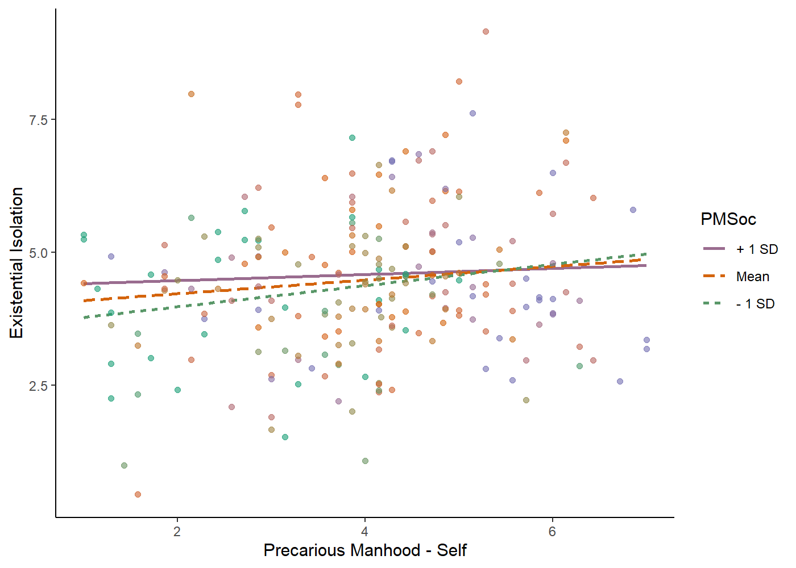<!-- -->


```r
mod4 <- lm(EI ~ FalseCons + PMClose + PMSoc + PMClose*PMSoc,
           data = out_data)

summ(mod4)
```

<table class="table table-striped table-hover table-condensed table-responsive" style="width: auto !important; margin-left: auto; margin-right: auto;">
<tbody>
  <tr>
   <td style="text-align:left;font-weight: bold;"> Observations </td>
   <td style="text-align:right;"> 225 </td>
  </tr>
  <tr>
   <td style="text-align:left;font-weight: bold;"> Dependent variable </td>
   <td style="text-align:right;"> EI </td>
  </tr>
  <tr>
   <td style="text-align:left;font-weight: bold;"> Type </td>
   <td style="text-align:right;"> OLS linear regression </td>
  </tr>
</tbody>
</table> <table class="table table-striped table-hover table-condensed table-responsive" style="width: auto !important; margin-left: auto; margin-right: auto;">
<tbody>
  <tr>
   <td style="text-align:left;font-weight: bold;"> F(4,220) </td>
   <td style="text-align:right;"> 4.26 </td>
  </tr>
  <tr>
   <td style="text-align:left;font-weight: bold;"> R² </td>
   <td style="text-align:right;"> 0.07 </td>
  </tr>
  <tr>
   <td style="text-align:left;font-weight: bold;"> Adj. R² </td>
   <td style="text-align:right;"> 0.06 </td>
  </tr>
</tbody>
</table> <table class="table table-striped table-hover table-condensed table-responsive" style="width: auto !important; margin-left: auto; margin-right: auto;border-bottom: 0;">
 <thead>
  <tr>
   <th style="text-align:left;">   </th>
   <th style="text-align:right;"> Est. </th>
   <th style="text-align:right;"> S.E. </th>
   <th style="text-align:right;"> t val. </th>
   <th style="text-align:right;"> p </th>
  </tr>
 </thead>
<tbody>
  <tr>
   <td style="text-align:left;font-weight: bold;"> (Intercept) </td>
   <td style="text-align:right;"> 3.49 </td>
   <td style="text-align:right;"> 1.10 </td>
   <td style="text-align:right;"> 3.18 </td>
   <td style="text-align:right;"> 0.00 </td>
  </tr>
  <tr>
   <td style="text-align:left;font-weight: bold;"> FalseCons </td>
   <td style="text-align:right;"> -0.03 </td>
   <td style="text-align:right;"> 0.01 </td>
   <td style="text-align:right;"> -3.11 </td>
   <td style="text-align:right;"> 0.00 </td>
  </tr>
  <tr>
   <td style="text-align:left;font-weight: bold;"> PMClose </td>
   <td style="text-align:right;"> 0.51 </td>
   <td style="text-align:right;"> 0.28 </td>
   <td style="text-align:right;"> 1.86 </td>
   <td style="text-align:right;"> 0.06 </td>
  </tr>
  <tr>
   <td style="text-align:left;font-weight: bold;"> PMSoc </td>
   <td style="text-align:right;"> 0.49 </td>
   <td style="text-align:right;"> 0.22 </td>
   <td style="text-align:right;"> 2.24 </td>
   <td style="text-align:right;"> 0.03 </td>
  </tr>
  <tr>
   <td style="text-align:left;font-weight: bold;"> PMClose:PMSoc </td>
   <td style="text-align:right;"> -0.10 </td>
   <td style="text-align:right;"> 0.06 </td>
   <td style="text-align:right;"> -1.72 </td>
   <td style="text-align:right;"> 0.09 </td>
  </tr>
</tbody>
<tfoot><tr><td style="padding: 0; " colspan="100%">
<sup></sup> Standard errors: OLS</td></tr></tfoot>
</table>

```r
sim_slopes(mod4, 
           pred = PMClose, 
           modx = PMSoc,
           johnson_neyman = TRUE)
```

```
## JOHNSON-NEYMAN INTERVAL 
## 
## The Johnson-Neyman interval could not be found. Is the p value for your
## interaction term below the specified alpha?
## 
## SIMPLE SLOPES ANALYSIS 
## 
## Slope of PMClose when PMSoc = 3.62 (- 1 SD): 
## 
##   Est.   S.E.   t val.      p
## ------ ------ -------- ------
##   0.17   0.10     1.66   0.10
## 
## Slope of PMClose when PMSoc = 4.72 (Mean): 
## 
##   Est.   S.E.   t val.      p
## ------ ------ -------- ------
##   0.06   0.08     0.78   0.44
## 
## Slope of PMClose when PMSoc = 5.83 (+ 1 SD): 
## 
##    Est.   S.E.   t val.      p
## ------- ------ -------- ------
##   -0.05   0.10    -0.47   0.64
```

```r
mod4_plot <- interact_plot(mod4, 
                           pred = PMClose, 
                           modx = PMSoc,
                           plot.points = TRUE,
                           partial.residuals = TRUE,
                           colors = "Dark2") +
  xlab("Precarious Manhood - Close Others") +
  ylab("Existential Isolation") +
  theme_classic()

mod4_jn_plot <- johnson_neyman(mod4, 
                               pred = PMClose, 
                               modx = PMSoc,
                               alpha = .05)


mod4_plot
```

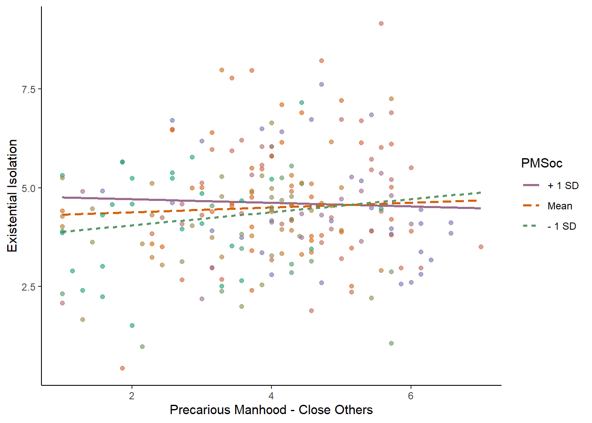<!-- -->

```r
mod4_jn_plot
```

```
## JOHNSON-NEYMAN INTERVAL 
## 
## The Johnson-Neyman interval could not be found. Is the p value for your
## interaction term below the specified alpha?
```

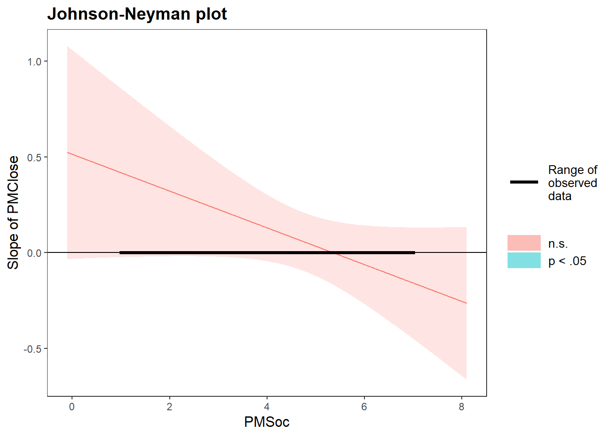<!-- -->


```r
mod5 <- lm(EI ~ lonely + FalseCons + PMSelf + PMClose + PMSelf*PMClose,
           data = out_data)

summ(mod5)
```

<table class="table table-striped table-hover table-condensed table-responsive" style="width: auto !important; margin-left: auto; margin-right: auto;">
<tbody>
  <tr>
   <td style="text-align:left;font-weight: bold;"> Observations </td>
   <td style="text-align:right;"> 225 </td>
  </tr>
  <tr>
   <td style="text-align:left;font-weight: bold;"> Dependent variable </td>
   <td style="text-align:right;"> EI </td>
  </tr>
  <tr>
   <td style="text-align:left;font-weight: bold;"> Type </td>
   <td style="text-align:right;"> OLS linear regression </td>
  </tr>
</tbody>
</table> <table class="table table-striped table-hover table-condensed table-responsive" style="width: auto !important; margin-left: auto; margin-right: auto;">
<tbody>
  <tr>
   <td style="text-align:left;font-weight: bold;"> F(5,219) </td>
   <td style="text-align:right;"> 10.48 </td>
  </tr>
  <tr>
   <td style="text-align:left;font-weight: bold;"> R² </td>
   <td style="text-align:right;"> 0.19 </td>
  </tr>
  <tr>
   <td style="text-align:left;font-weight: bold;"> Adj. R² </td>
   <td style="text-align:right;"> 0.17 </td>
  </tr>
</tbody>
</table> <table class="table table-striped table-hover table-condensed table-responsive" style="width: auto !important; margin-left: auto; margin-right: auto;border-bottom: 0;">
 <thead>
  <tr>
   <th style="text-align:left;">   </th>
   <th style="text-align:right;"> Est. </th>
   <th style="text-align:right;"> S.E. </th>
   <th style="text-align:right;"> t val. </th>
   <th style="text-align:right;"> p </th>
  </tr>
 </thead>
<tbody>
  <tr>
   <td style="text-align:left;font-weight: bold;"> (Intercept) </td>
   <td style="text-align:right;"> 3.46 </td>
   <td style="text-align:right;"> 0.78 </td>
   <td style="text-align:right;"> 4.41 </td>
   <td style="text-align:right;"> 0.00 </td>
  </tr>
  <tr>
   <td style="text-align:left;font-weight: bold;"> lonely </td>
   <td style="text-align:right;"> 1.09 </td>
   <td style="text-align:right;"> 0.19 </td>
   <td style="text-align:right;"> 5.76 </td>
   <td style="text-align:right;"> 0.00 </td>
  </tr>
  <tr>
   <td style="text-align:left;font-weight: bold;"> FalseCons </td>
   <td style="text-align:right;"> -0.02 </td>
   <td style="text-align:right;"> 0.01 </td>
   <td style="text-align:right;"> -2.63 </td>
   <td style="text-align:right;"> 0.01 </td>
  </tr>
  <tr>
   <td style="text-align:left;font-weight: bold;"> PMSelf </td>
   <td style="text-align:right;"> 0.31 </td>
   <td style="text-align:right;"> 0.19 </td>
   <td style="text-align:right;"> 1.68 </td>
   <td style="text-align:right;"> 0.09 </td>
  </tr>
  <tr>
   <td style="text-align:left;font-weight: bold;"> PMClose </td>
   <td style="text-align:right;"> 0.24 </td>
   <td style="text-align:right;"> 0.18 </td>
   <td style="text-align:right;"> 1.31 </td>
   <td style="text-align:right;"> 0.19 </td>
  </tr>
  <tr>
   <td style="text-align:left;font-weight: bold;"> PMSelf:PMClose </td>
   <td style="text-align:right;"> -0.06 </td>
   <td style="text-align:right;"> 0.04 </td>
   <td style="text-align:right;"> -1.37 </td>
   <td style="text-align:right;"> 0.17 </td>
  </tr>
</tbody>
<tfoot><tr><td style="padding: 0; " colspan="100%">
<sup></sup> Standard errors: OLS</td></tr></tfoot>
</table>

```r
sim_slopes(mod5, 
           pred = PMSelf, 
           modx = PMClose,
           johnson_neyman = TRUE)
```

```
## JOHNSON-NEYMAN INTERVAL 
## 
## The Johnson-Neyman interval could not be found. Is the p value for your
## interaction term below the specified alpha?
## 
## SIMPLE SLOPES ANALYSIS 
## 
## Slope of PMSelf when PMClose = 2.55 (- 1 SD): 
## 
##   Est.   S.E.   t val.      p
## ------ ------ -------- ------
##   0.16   0.10     1.56   0.12
## 
## Slope of PMSelf when PMClose = 3.92 (Mean): 
## 
##   Est.   S.E.   t val.      p
## ------ ------ -------- ------
##   0.08   0.09     0.91   0.36
## 
## Slope of PMSelf when PMClose = 5.29 (+ 1 SD): 
## 
##   Est.   S.E.   t val.      p
## ------ ------ -------- ------
##   0.00   0.11     0.01   0.99
```

```r
mod5_plot <- interact_plot(mod5, 
                           pred = PMSelf, 
                           modx = PMClose,
                           plot.points = TRUE,
                           partial.residuals = TRUE,
                           colors = "Dark2") +
  xlab("Precarious Manhood - Self") +
  ylab("Existential Isolation") +
  theme_classic()

mod5_jn_plot <- johnson_neyman(mod1, 
                               pred = PMSelf, 
                               modx = PMClose,
                               alpha = .05)

mod5_plot
```

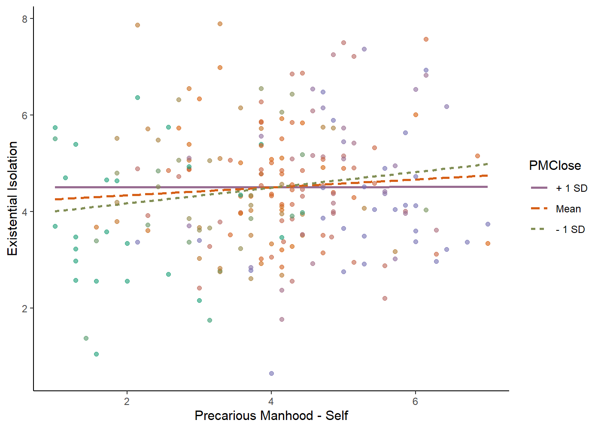<!-- -->

```r
mod5_jn_plot
```

```
## JOHNSON-NEYMAN INTERVAL 
## 
## When PMClose is INSIDE the interval [-3.29, 3.27], the slope of PMSelf is p
## < .05.
## 
## Note: The range of observed values of PMClose is [1.00, 7.00]
```

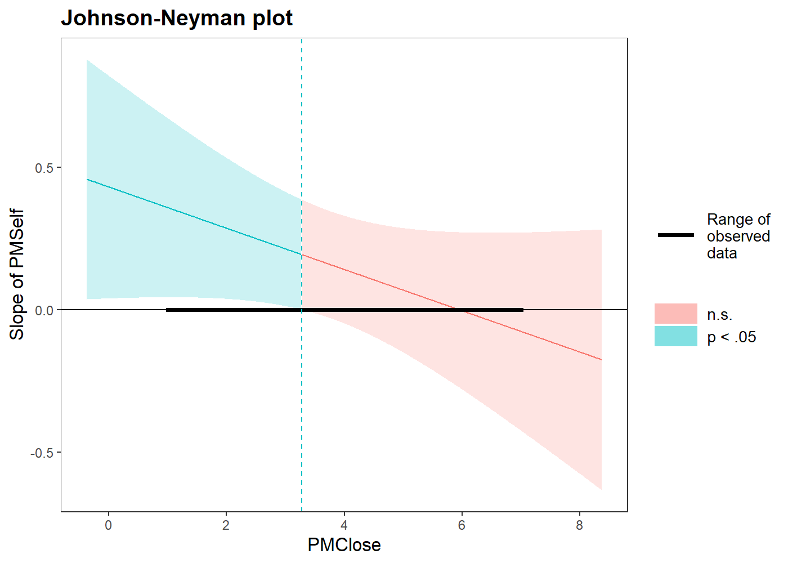<!-- -->


```r
mod2 <- lm(EI ~ lonely + PMSelf + PMClose + PMSelf*PMClose,
           data = out_data)

summ(mod2)
```

<table class="table table-striped table-hover table-condensed table-responsive" style="width: auto !important; margin-left: auto; margin-right: auto;">
<tbody>
  <tr>
   <td style="text-align:left;font-weight: bold;"> Observations </td>
   <td style="text-align:right;"> 225 </td>
  </tr>
  <tr>
   <td style="text-align:left;font-weight: bold;"> Dependent variable </td>
   <td style="text-align:right;"> EI </td>
  </tr>
  <tr>
   <td style="text-align:left;font-weight: bold;"> Type </td>
   <td style="text-align:right;"> OLS linear regression </td>
  </tr>
</tbody>
</table> <table class="table table-striped table-hover table-condensed table-responsive" style="width: auto !important; margin-left: auto; margin-right: auto;">
<tbody>
  <tr>
   <td style="text-align:left;font-weight: bold;"> F(4,220) </td>
   <td style="text-align:right;"> 11.08 </td>
  </tr>
  <tr>
   <td style="text-align:left;font-weight: bold;"> R² </td>
   <td style="text-align:right;"> 0.17 </td>
  </tr>
  <tr>
   <td style="text-align:left;font-weight: bold;"> Adj. R² </td>
   <td style="text-align:right;"> 0.15 </td>
  </tr>
</tbody>
</table> <table class="table table-striped table-hover table-condensed table-responsive" style="width: auto !important; margin-left: auto; margin-right: auto;border-bottom: 0;">
 <thead>
  <tr>
   <th style="text-align:left;">   </th>
   <th style="text-align:right;"> Est. </th>
   <th style="text-align:right;"> S.E. </th>
   <th style="text-align:right;"> t val. </th>
   <th style="text-align:right;"> p </th>
  </tr>
 </thead>
<tbody>
  <tr>
   <td style="text-align:left;font-weight: bold;"> (Intercept) </td>
   <td style="text-align:right;"> 2.25 </td>
   <td style="text-align:right;"> 0.64 </td>
   <td style="text-align:right;"> 3.49 </td>
   <td style="text-align:right;"> 0.00 </td>
  </tr>
  <tr>
   <td style="text-align:left;font-weight: bold;"> lonely </td>
   <td style="text-align:right;"> 1.14 </td>
   <td style="text-align:right;"> 0.19 </td>
   <td style="text-align:right;"> 6.01 </td>
   <td style="text-align:right;"> 0.00 </td>
  </tr>
  <tr>
   <td style="text-align:left;font-weight: bold;"> PMSelf </td>
   <td style="text-align:right;"> 0.28 </td>
   <td style="text-align:right;"> 0.19 </td>
   <td style="text-align:right;"> 1.51 </td>
   <td style="text-align:right;"> 0.13 </td>
  </tr>
  <tr>
   <td style="text-align:left;font-weight: bold;"> PMClose </td>
   <td style="text-align:right;"> 0.24 </td>
   <td style="text-align:right;"> 0.19 </td>
   <td style="text-align:right;"> 1.28 </td>
   <td style="text-align:right;"> 0.20 </td>
  </tr>
  <tr>
   <td style="text-align:left;font-weight: bold;"> PMSelf:PMClose </td>
   <td style="text-align:right;"> -0.06 </td>
   <td style="text-align:right;"> 0.04 </td>
   <td style="text-align:right;"> -1.27 </td>
   <td style="text-align:right;"> 0.21 </td>
  </tr>
</tbody>
<tfoot><tr><td style="padding: 0; " colspan="100%">
<sup></sup> Standard errors: OLS</td></tr></tfoot>
</table>

```r
sim_slopes(mod2, 
           pred = PMSelf, 
           modx = PMClose,
           johnson_neyman = TRUE)
```

```
## JOHNSON-NEYMAN INTERVAL 
## 
## The Johnson-Neyman interval could not be found. Is the p value for your
## interaction term below the specified alpha?
## 
## SIMPLE SLOPES ANALYSIS 
## 
## Slope of PMSelf when PMClose = 2.55 (- 1 SD): 
## 
##   Est.   S.E.   t val.      p
## ------ ------ -------- ------
##   0.14   0.11     1.36   0.18
## 
## Slope of PMSelf when PMClose = 3.92 (Mean): 
## 
##   Est.   S.E.   t val.      p
## ------ ------ -------- ------
##   0.07   0.09     0.74   0.46
## 
## Slope of PMSelf when PMClose = 5.29 (+ 1 SD): 
## 
##    Est.   S.E.   t val.      p
## ------- ------ -------- ------
##   -0.01   0.11    -0.07   0.94
```

```r
mod2_plot <- interact_plot(mod2, 
                           pred = PMSelf, 
                           modx = PMClose,
                           plot.points = TRUE,
                           partial.residuals = TRUE,
                           colors = "Dark2") +
  xlab("Precarious Manhood - Self") +
  ylab("Existential Isolation") +
  theme_classic()

mod2_jn_plot <- johnson_neyman(mod2, 
                               pred = PMSelf, 
                               modx = PMClose,
                               alpha = .05)

mod2_plot
```

<!-- -->

```r
mod2_jn_plot
```

```
## JOHNSON-NEYMAN INTERVAL 
## 
## The Johnson-Neyman interval could not be found. Is the p value for your
## interaction term below the specified alpha?
```

<!-- -->


### **Exploratory Regression Model**

### Just for kicks, I was curious as to whether men who endorse PM and adhere strongly to masculine norms would report more aggressive behavior. This isn't a novel hypothesis by an means, but I wanted to confirm that pre-existing associations between masculinity and aggression were present in our data. The findings are consistent with this: among men who report high levels of conformity to masculine norms, the more they endorse PM, the more aggressive they are. For these men, both adhering to masculine norms and feeling as though their manhood status could be yannked away from them at a moment's notice play into aggressive behavior.


```r
mod2 <- lm(agg ~ PMSelf + cmni + PMSelf*cmni,
           data = data)

summ(mod2)
```

<table class="table table-striped table-hover table-condensed table-responsive" style="width: auto !important; margin-left: auto; margin-right: auto;">
<tbody>
  <tr>
   <td style="text-align:left;font-weight: bold;"> Observations </td>
   <td style="text-align:right;"> 278 (13 missing obs. deleted) </td>
  </tr>
  <tr>
   <td style="text-align:left;font-weight: bold;"> Dependent variable </td>
   <td style="text-align:right;"> agg </td>
  </tr>
  <tr>
   <td style="text-align:left;font-weight: bold;"> Type </td>
   <td style="text-align:right;"> OLS linear regression </td>
  </tr>
</tbody>
</table> <table class="table table-striped table-hover table-condensed table-responsive" style="width: auto !important; margin-left: auto; margin-right: auto;">
<tbody>
  <tr>
   <td style="text-align:left;font-weight: bold;"> F(3,274) </td>
   <td style="text-align:right;"> 28.96 </td>
  </tr>
  <tr>
   <td style="text-align:left;font-weight: bold;"> R² </td>
   <td style="text-align:right;"> 0.24 </td>
  </tr>
  <tr>
   <td style="text-align:left;font-weight: bold;"> Adj. R² </td>
   <td style="text-align:right;"> 0.23 </td>
  </tr>
</tbody>
</table> <table class="table table-striped table-hover table-condensed table-responsive" style="width: auto !important; margin-left: auto; margin-right: auto;border-bottom: 0;">
 <thead>
  <tr>
   <th style="text-align:left;">   </th>
   <th style="text-align:right;"> Est. </th>
   <th style="text-align:right;"> S.E. </th>
   <th style="text-align:right;"> t val. </th>
   <th style="text-align:right;"> p </th>
  </tr>
 </thead>
<tbody>
  <tr>
   <td style="text-align:left;font-weight: bold;"> (Intercept) </td>
   <td style="text-align:right;"> 1.86 </td>
   <td style="text-align:right;"> 0.89 </td>
   <td style="text-align:right;"> 2.09 </td>
   <td style="text-align:right;"> 0.04 </td>
  </tr>
  <tr>
   <td style="text-align:left;font-weight: bold;"> PMSelf </td>
   <td style="text-align:right;"> -0.34 </td>
   <td style="text-align:right;"> 0.22 </td>
   <td style="text-align:right;"> -1.58 </td>
   <td style="text-align:right;"> 0.12 </td>
  </tr>
  <tr>
   <td style="text-align:left;font-weight: bold;"> cmni </td>
   <td style="text-align:right;"> 0.40 </td>
   <td style="text-align:right;"> 0.40 </td>
   <td style="text-align:right;"> 1.00 </td>
   <td style="text-align:right;"> 0.32 </td>
  </tr>
  <tr>
   <td style="text-align:left;font-weight: bold;"> PMSelf:cmni </td>
   <td style="text-align:right;"> 0.20 </td>
   <td style="text-align:right;"> 0.10 </td>
   <td style="text-align:right;"> 2.09 </td>
   <td style="text-align:right;"> 0.04 </td>
  </tr>
</tbody>
<tfoot><tr><td style="padding: 0; " colspan="100%">
<sup></sup> Standard errors: OLS</td></tr></tfoot>
</table>

```r
sim_slopes(mod2, 
           pred = PMSelf, 
           modx = cmni,
           johnson_neyman = TRUE,
           control.fdr = TRUE)
```

```
## JOHNSON-NEYMAN INTERVAL 
## 
## When cmni is INSIDE the interval [2.12, 27.38], the slope of PMSelf is p <
## .05.
## 
## Note: The range of observed values of cmni is [1.43, 3.48]
## 
## Interval calculated using false discovery rate adjusted t = 2.14 
## 
## SIMPLE SLOPES ANALYSIS 
## 
## Slope of PMSelf when cmni = 1.96 (- 1 SD): 
## 
##   Est.   S.E.   t val.      p
## ------ ------ -------- ------
##   0.05   0.04     1.07   0.29
## 
## Slope of PMSelf when cmni = 2.29 (Mean): 
## 
##   Est.   S.E.   t val.      p
## ------ ------ -------- ------
##   0.11   0.03     3.27   0.00
## 
## Slope of PMSelf when cmni = 2.62 (+ 1 SD): 
## 
##   Est.   S.E.   t val.      p
## ------ ------ -------- ------
##   0.18   0.05     3.65   0.00
```

```r
mod2_plot <- interact_plot(mod2, 
                           pred = PMSelf, 
                           modx = cmni,
                           plot.points = TRUE,
                           partial.residuals = TRUE,
                           colors = "Dark2") +
  xlab("Precarious Manhood - Self") +
  ylab("Aggression") +
  theme_classic()

mod2_jn_plot <- johnson_neyman(mod2, 
                               pred = PMSelf, 
                               modx = cmni,
                               alpha = .05)

mod2_plot
```

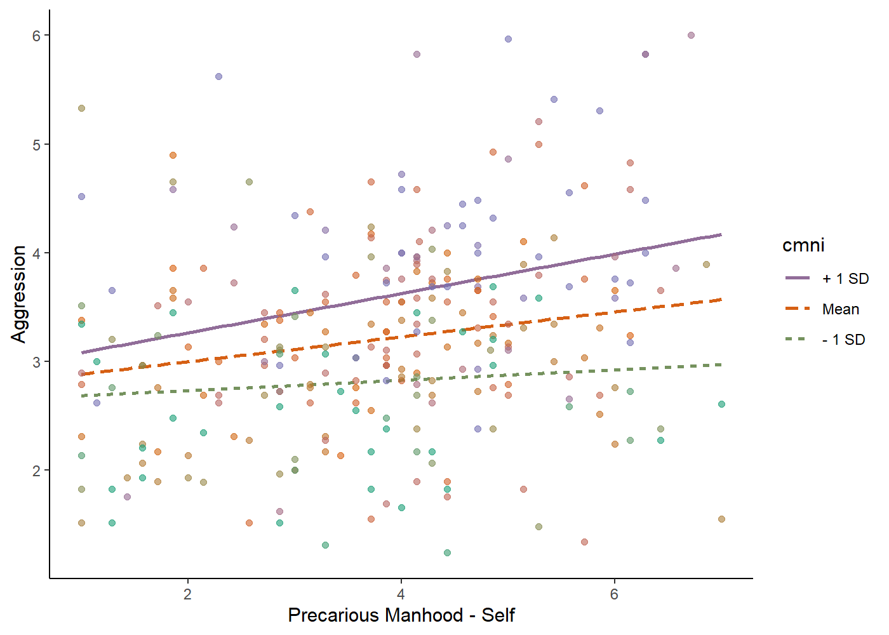<!-- -->

```r
mod2_jn_plot
```

```
## JOHNSON-NEYMAN INTERVAL 
## 
## When cmni is OUTSIDE the interval [-6.73, 2.09], the slope of PMSelf is p <
## .05.
## 
## Note: The range of observed values of cmni is [1.43, 3.48]
```

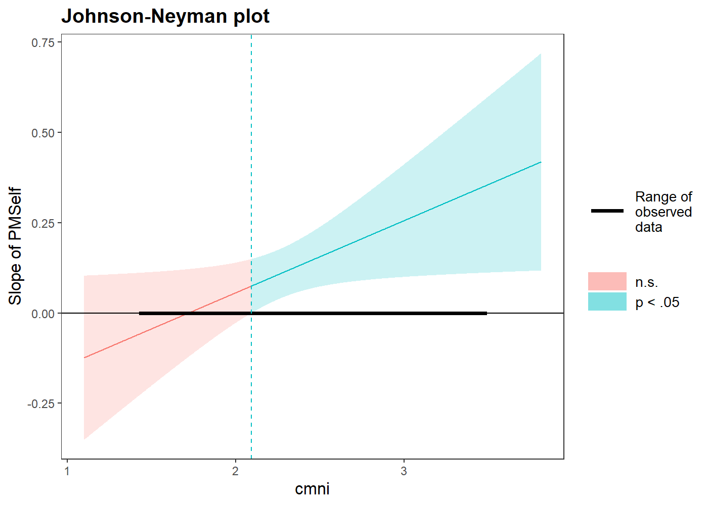<!-- -->


## Summary

### Our main hypothesized interaction did not fully replicate. However, there were some promising findings that I will follow up on in subsequent analyses.
