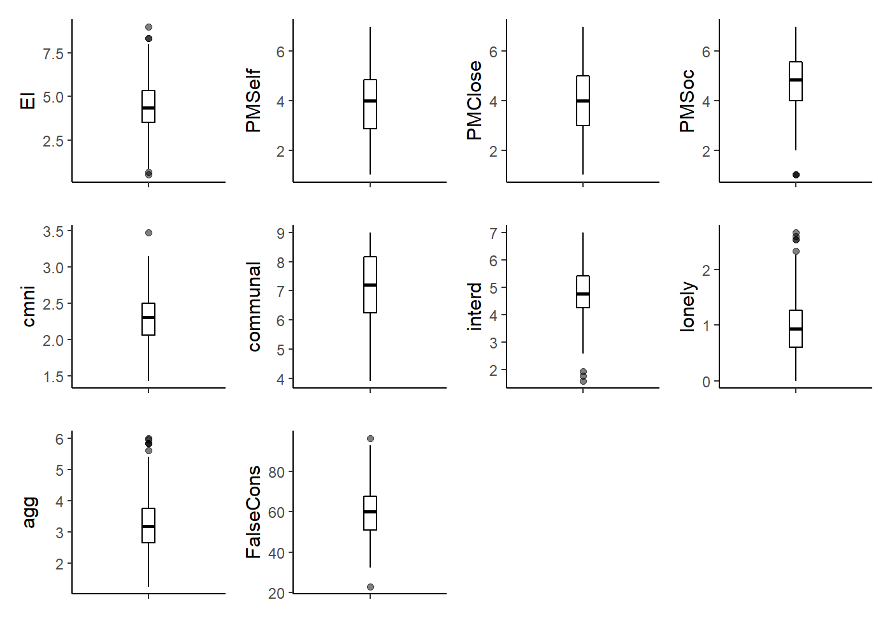
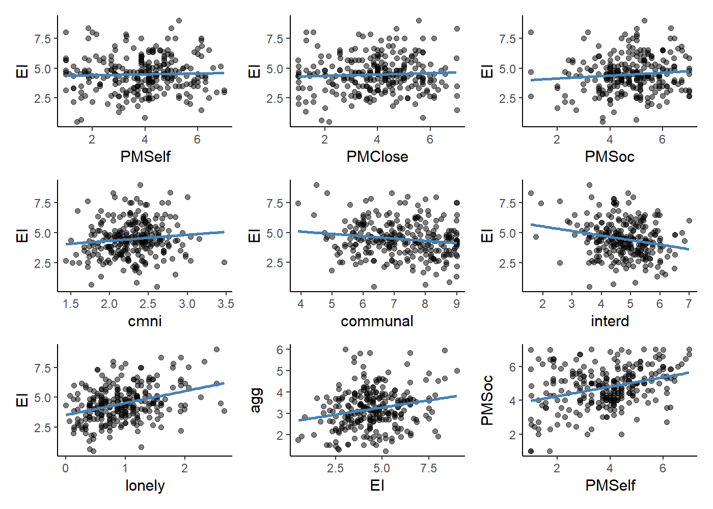

# Existential Isolation and Precarious Manhood

### This project seeks to examine whether normative conceptions of masculinity are the underlying mechanism of the finding that men tend to experience more existential isolation (EI) than women. Existential isolation is the feeling of being subjctively alone in one's experiences. For example, not laughing at a joke that a group of people you're with would be an existentially isolating experience. Everyone experiences EI to some degree or another, but for those who are more existentially isolated, two fundamental human needs are stymied: the need to know and the need to belong. Thus, for some, EI is psychologically damaging and can have negative donwstream outcomes such as loneliness, depression, and anxiety.


### In the West, men consistently report more EI than women. Previous research has suggested that this is driven largely by men's relatively lower endorsement of communal values. That is, men, compared to women, tend to report that they value communality less, and this in turn predicts men's endorsement of EI. However, in a previous study, we attempted to replicate these findings, and found that it was not communal norms that differentiated men and women, but rather a mismatch between participants' self-reported precariousness manhood (PM) beliefs and the extent to which they believed society endorsed PM. Precarious manhood is the idea that manhood, compared to womanhood, is a tenuous, desirable status that must be earned, is socially conferred, and can easily be lost. In our previous study, men who did not endorse PM beliefs but believed they were prevalent in American society were significantly higher in EI than those who endorsed PM beliefs or those who did not believe they were societally prevalent.


### This study is a follow-up to attempt to replicate our previous findings and extend them to aggression, a consequence of threatened masculinty. Over the course of 3 semesters, we sampled 291 college students on a variety of scales, including EI, PM self beliefs, PM beliefs among close friends/family, PM beliefs in society, conformity to masculine norms, communality, interdependence, loneliness, and aggression.


### **Histograms and Descriptives**

### First, we'll examine the histograms of our variables of interest. I wrote a function for the histograms instead of rewriting the code for each plot. Precarious manhood - self and PM - close others mirror each other in terms of distributions, whereas PM- society is slightly skewed. No values are outside the expected range.


```r
hist_funct <- function(.dat, variable, xlabel) {
  plot_out <- .dat %>% 
    filter(sex == 1) %>% 
    ggplot() +
    aes(x = {{variable}}) +
    geom_histogram(aes(y = ..density..),
                   color = "black", 
                   fill = "white") +
    geom_density(alpha = 0.2, fill = "#FF6666") +
    xlab(xlabel)
  
  return(plot_out)
}

h1 <- hist_funct(data, EI, "Existential Isolation")
h2 <- hist_funct(data, PMSelf, "PM - Self")
h3 <- hist_funct(data, PMClose, "PM - Close Others")
h4 <- hist_funct(data, PMSoc, "PM - Society")
h5 <- hist_funct(data, cmni, "Conformity to\n Masculine Norms")
h6 <- hist_funct(data, communal, "Communality")
h7 <- hist_funct(data, interd, "Interdependence")
h8 <- hist_funct(data, lonely, "Loneliness")
h9 <- hist_funct(data, agg, "Aggression")


wrap_plots(h1, h2, h3, h4, h5, h6, h7, h8, h9)
```

<!-- -->


```r
variables <- c("EI", "PMSelf", "PMClose", "PMSoc", "cmni", "communal", "interd", "lonely", "agg")

tab1 <- data %>% 
  filter(sex == 1) %>%
  summarize(across(all_of(variables), 
                   list(Mean = mean, 
                        SD = sd,
                        Median = median,
                        Min = min,
                        Max = max), 
                   na.rm = TRUE)) %>% 
  pivot_longer(cols = everything(), 
               names_to = c("Scale", ".value"), 
               names_sep = "_")

tab1 %>% 
  kbl(digits = 2,
      caption = "Descriptive Statistics") %>%
  kable_paper(font_size = 20,
              bootstrap_options = c("striped", "responsive"))
```

<table class=" lightable-paper" style='font-size: 20px; font-family: "Arial Narrow", arial, helvetica, sans-serif; margin-left: auto; margin-right: auto;'>
<caption style="font-size: initial !important;">Descriptive Statistics</caption>
 <thead>
  <tr>
   <th style="text-align:left;"> Scale </th>
   <th style="text-align:right;"> Mean </th>
   <th style="text-align:right;"> SD </th>
   <th style="text-align:right;"> Median </th>
   <th style="text-align:right;"> Min </th>
   <th style="text-align:right;"> Max </th>
  </tr>
 </thead>
<tbody>
  <tr>
   <td style="text-align:left;"> EI </td>
   <td style="text-align:right;"> 4.49 </td>
   <td style="text-align:right;"> 1.49 </td>
   <td style="text-align:right;"> 4.33 </td>
   <td style="text-align:right;"> 0.50 </td>
   <td style="text-align:right;"> 9.00 </td>
  </tr>
  <tr>
   <td style="text-align:left;"> PMSelf </td>
   <td style="text-align:right;"> 3.87 </td>
   <td style="text-align:right;"> 1.43 </td>
   <td style="text-align:right;"> 4.00 </td>
   <td style="text-align:right;"> 1.00 </td>
   <td style="text-align:right;"> 7.00 </td>
  </tr>
  <tr>
   <td style="text-align:left;"> PMClose </td>
   <td style="text-align:right;"> 3.94 </td>
   <td style="text-align:right;"> 1.47 </td>
   <td style="text-align:right;"> 4.00 </td>
   <td style="text-align:right;"> 1.00 </td>
   <td style="text-align:right;"> 7.00 </td>
  </tr>
  <tr>
   <td style="text-align:left;"> PMSoc </td>
   <td style="text-align:right;"> 4.77 </td>
   <td style="text-align:right;"> 1.19 </td>
   <td style="text-align:right;"> 4.86 </td>
   <td style="text-align:right;"> 1.00 </td>
   <td style="text-align:right;"> 7.00 </td>
  </tr>
  <tr>
   <td style="text-align:left;"> cmni </td>
   <td style="text-align:right;"> 2.29 </td>
   <td style="text-align:right;"> 0.34 </td>
   <td style="text-align:right;"> 2.30 </td>
   <td style="text-align:right;"> 1.43 </td>
   <td style="text-align:right;"> 3.48 </td>
  </tr>
  <tr>
   <td style="text-align:left;"> communal </td>
   <td style="text-align:right;"> 7.21 </td>
   <td style="text-align:right;"> 1.17 </td>
   <td style="text-align:right;"> 7.25 </td>
   <td style="text-align:right;"> 3.92 </td>
   <td style="text-align:right;"> 9.00 </td>
  </tr>
  <tr>
   <td style="text-align:left;"> interd </td>
   <td style="text-align:right;"> 4.77 </td>
   <td style="text-align:right;"> 0.87 </td>
   <td style="text-align:right;"> 4.79 </td>
   <td style="text-align:right;"> 1.58 </td>
   <td style="text-align:right;"> 7.00 </td>
  </tr>
  <tr>
   <td style="text-align:left;"> lonely </td>
   <td style="text-align:right;"> 0.96 </td>
   <td style="text-align:right;"> 0.52 </td>
   <td style="text-align:right;"> 0.93 </td>
   <td style="text-align:right;"> 0.00 </td>
   <td style="text-align:right;"> 2.67 </td>
  </tr>
  <tr>
   <td style="text-align:left;"> agg </td>
   <td style="text-align:right;"> 3.22 </td>
   <td style="text-align:right;"> 0.94 </td>
   <td style="text-align:right;"> 3.18 </td>
   <td style="text-align:right;"> 1.24 </td>
   <td style="text-align:right;"> 6.00 </td>
  </tr>
</tbody>
</table>

### **Boxplots**

### Again, I wrote a function for the univariate boxplots, just to see what the outlier situation was like. There are a few outliers in EI, interdependence, loneliness, and aggeression.


```r
uni_boxplot_funct <- function(.dat, variable){
  plot_out <- .dat %>% 
    filter(sex ==1) %>% 
    ggplot() +
    aes(x = "", y = {{variable}}) +
    geom_boxplot(color = "black",
                 alpha = .5,
                 width = .1,
                 size = .5) +
    theme(axis.title.x = element_blank())
  
  return(plot_out)
}

bp1 <- uni_boxplot_funct(data, EI)
bp2 <- uni_boxplot_funct(data, PMSelf)
bp3 <- uni_boxplot_funct(data, PMClose)
bp4 <- uni_boxplot_funct(data, PMSoc)
bp5 <- uni_boxplot_funct(data, cmni)
bp6 <- uni_boxplot_funct(data, communal)
bp7 <- uni_boxplot_funct(data, interd)
bp8 <- uni_boxplot_funct(data, lonely)
bp9 <- uni_boxplot_funct(data, agg)


bp1+bp2+bp3+bp4+bp5+bp6+bp7+bp8+bp9
```

<!-- -->

### **Scatterplots**

### Below is a function for scatterplots along with a paired plot using the GGally package. Surprisingly, EI is completely uncorrelated with any of the PM variables. There appears to be no association between EI and PM in this sample, which is counter to our hypotheses. 


```r
scatter_funct <- function(.dat, xvar, yvar){
  plot_out <- .dat %>% 
    filter(sex == 1) %>% 
    ggplot()+
    aes(x ={{xvar}},
      y = {{yvar}}) +
  geom_jitter(alpha = 0.5) +
  geom_smooth(method = "lm",
              se = FALSE,
              color = "steelblue")
  
  return(plot_out)
}

p1 <- scatter_funct(data, PMSelf, EI)
p2 <- scatter_funct(data, PMClose, EI)
p3 <- scatter_funct(data, PMSoc, EI)
p4 <- scatter_funct(data, cmni, EI)
p5 <- scatter_funct(data, communal, EI)
p6 <- scatter_funct(data, interd, EI)
p7 <- scatter_funct(data, lonely, EI)
p8 <- scatter_funct(data, EI, agg)
p9 <- scatter_funct(data, PMSelf, PMSoc)


p1 + p2 + p3 +p4+p5+p6+p7+p8+p9
```

<!-- -->

```r
data_focal <- data[, c("EI", "PMSelf", "PMClose", "PMSoc", "cmni", "communal", "interd", "lonely", "agg")]

GGally::ggpairs(data_focal,
                aes(alpha = 0.7))
```

<!-- -->

### **Hypothesized Regression Model**

### Now we'll take a look at some regression models. Controlling for loneliness, the interaction of PM-Self and PM-close others is a significant predictor of EI. However, simple slope and Johnson-Neyman analyses reveal that the simple slope of PM-self predicting EI is only significant for men who reported PM-close between 1.00 and 1.18, a tiny subset of our sample. However, among these men (i.e., those who report very low PM beliefs among close friends/family), there is a positive association between PM-self and EI. That is, for men whose close friends/family do not endorse PM, the more they personally endorse PM beliefs, the more existentially isolated they feel. This makes sense given the theory of EI - feeling as though your experiences do not match those of other people causes EI.


```r
mod1 <- lm(EI ~ lonely + PMSelf + PMClose + PMSelf*PMClose,
           data = data)

summ(mod1)
```

<table class="table table-striped table-hover table-condensed table-responsive" style="width: auto !important; margin-left: auto; margin-right: auto;">
<tbody>
  <tr>
   <td style="text-align:left;font-weight: bold;"> Observations </td>
   <td style="text-align:right;"> 276 (15 missing obs. deleted) </td>
  </tr>
  <tr>
   <td style="text-align:left;font-weight: bold;"> Dependent variable </td>
   <td style="text-align:right;"> EI </td>
  </tr>
  <tr>
   <td style="text-align:left;font-weight: bold;"> Type </td>
   <td style="text-align:right;"> OLS linear regression </td>
  </tr>
</tbody>
</table> <table class="table table-striped table-hover table-condensed table-responsive" style="width: auto !important; margin-left: auto; margin-right: auto;">
<tbody>
  <tr>
   <td style="text-align:left;font-weight: bold;"> F(4,271) </td>
   <td style="text-align:right;"> 10.92 </td>
  </tr>
  <tr>
   <td style="text-align:left;font-weight: bold;"> R² </td>
   <td style="text-align:right;"> 0.14 </td>
  </tr>
  <tr>
   <td style="text-align:left;font-weight: bold;"> Adj. R² </td>
   <td style="text-align:right;"> 0.13 </td>
  </tr>
</tbody>
</table> <table class="table table-striped table-hover table-condensed table-responsive" style="width: auto !important; margin-left: auto; margin-right: auto;border-bottom: 0;">
 <thead>
  <tr>
   <th style="text-align:left;">   </th>
   <th style="text-align:right;"> Est. </th>
   <th style="text-align:right;"> S.E. </th>
   <th style="text-align:right;"> t val. </th>
   <th style="text-align:right;"> p </th>
  </tr>
 </thead>
<tbody>
  <tr>
   <td style="text-align:left;font-weight: bold;"> (Intercept) </td>
   <td style="text-align:right;"> 2.48 </td>
   <td style="text-align:right;"> 0.56 </td>
   <td style="text-align:right;"> 4.46 </td>
   <td style="text-align:right;"> 0.00 </td>
  </tr>
  <tr>
   <td style="text-align:left;font-weight: bold;"> lonely </td>
   <td style="text-align:right;"> 0.99 </td>
   <td style="text-align:right;"> 0.16 </td>
   <td style="text-align:right;"> 6.23 </td>
   <td style="text-align:right;"> 0.00 </td>
  </tr>
  <tr>
   <td style="text-align:left;font-weight: bold;"> PMSelf </td>
   <td style="text-align:right;"> 0.35 </td>
   <td style="text-align:right;"> 0.17 </td>
   <td style="text-align:right;"> 2.07 </td>
   <td style="text-align:right;"> 0.04 </td>
  </tr>
  <tr>
   <td style="text-align:left;font-weight: bold;"> PMClose </td>
   <td style="text-align:right;"> 0.25 </td>
   <td style="text-align:right;"> 0.14 </td>
   <td style="text-align:right;"> 1.72 </td>
   <td style="text-align:right;"> 0.09 </td>
  </tr>
  <tr>
   <td style="text-align:left;font-weight: bold;"> PMSelf:PMClose </td>
   <td style="text-align:right;"> -0.08 </td>
   <td style="text-align:right;"> 0.04 </td>
   <td style="text-align:right;"> -2.10 </td>
   <td style="text-align:right;"> 0.04 </td>
  </tr>
</tbody>
<tfoot><tr><td style="padding: 0; " colspan="100%">
<sup></sup> Standard errors: OLS</td></tr></tfoot>
</table>

```r
sim_slopes(mod1, 
           pred = PMSelf, 
           modx = PMClose,
           johnson_neyman = TRUE)
```

```
## JOHNSON-NEYMAN INTERVAL 
## 
## When PMClose is OUTSIDE the interval [1.18, 13.37], the slope of PMSelf is
## p < .05.
## 
## Note: The range of observed values of PMClose is [1.00, 7.00]
## 
## SIMPLE SLOPES ANALYSIS 
## 
## Slope of PMSelf when PMClose = 2.46 (- 1 SD): 
## 
##   Est.   S.E.   t val.      p
## ------ ------ -------- ------
##   0.16   0.09     1.66   0.10
## 
## Slope of PMSelf when PMClose = 3.93 (Mean): 
## 
##   Est.   S.E.   t val.      p
## ------ ------ -------- ------
##   0.04   0.07     0.61   0.54
## 
## Slope of PMSelf when PMClose = 5.40 (+ 1 SD): 
## 
##    Est.   S.E.   t val.      p
## ------- ------ -------- ------
##   -0.07   0.09    -0.80   0.43
```

```r
mod1_plot <- interact_plot(mod1, 
                           pred = PMSelf, 
                           modx = PMClose,
                           plot.points = TRUE,
                           partial.residuals = TRUE,
                           colors = "Dark2") +
  xlab("Precarious Manhood - Self") +
  ylab("Existential Isolation") +
  theme_classic()

mod1_jn_plot <- johnson_neyman(mod1, 
                               pred = PMSelf, 
                               modx = PMClose,
                               alpha = .05)

mod1_plot
```

<!-- -->

```r
mod1_jn_plot
```

```
## JOHNSON-NEYMAN INTERVAL 
## 
## When PMClose is OUTSIDE the interval [1.18, 13.37], the slope of PMSelf is
## p < .05.
## 
## Note: The range of observed values of PMClose is [1.00, 7.00]
```

<!-- -->


### **Exploratory Regression Model**

### Just for kicks, I was curious as to whether men who endorse PM and adhere strongly to masculine norms would report more aggressive behavior. This isn't a novel hypothesis by an means, but I wanted to confirm that pre-existing associations between masculinity and aggression were present in our data. The findings are consistent with this: among men who report high levels of conformity to masculine norms, the more they endorse PM, the more aggressive they are. For these men, both adhering to masculine norms and feeling as though their manhood status could be yannked away from them at a moment's notice play into aggressive behavior.


```r
mod2 <- lm(agg ~ PMSelf + cmni + PMSelf*cmni,
           data = data)

summ(mod2)
```

<table class="table table-striped table-hover table-condensed table-responsive" style="width: auto !important; margin-left: auto; margin-right: auto;">
<tbody>
  <tr>
   <td style="text-align:left;font-weight: bold;"> Observations </td>
   <td style="text-align:right;"> 278 (13 missing obs. deleted) </td>
  </tr>
  <tr>
   <td style="text-align:left;font-weight: bold;"> Dependent variable </td>
   <td style="text-align:right;"> agg </td>
  </tr>
  <tr>
   <td style="text-align:left;font-weight: bold;"> Type </td>
   <td style="text-align:right;"> OLS linear regression </td>
  </tr>
</tbody>
</table> <table class="table table-striped table-hover table-condensed table-responsive" style="width: auto !important; margin-left: auto; margin-right: auto;">
<tbody>
  <tr>
   <td style="text-align:left;font-weight: bold;"> F(3,274) </td>
   <td style="text-align:right;"> 28.96 </td>
  </tr>
  <tr>
   <td style="text-align:left;font-weight: bold;"> R² </td>
   <td style="text-align:right;"> 0.24 </td>
  </tr>
  <tr>
   <td style="text-align:left;font-weight: bold;"> Adj. R² </td>
   <td style="text-align:right;"> 0.23 </td>
  </tr>
</tbody>
</table> <table class="table table-striped table-hover table-condensed table-responsive" style="width: auto !important; margin-left: auto; margin-right: auto;border-bottom: 0;">
 <thead>
  <tr>
   <th style="text-align:left;">   </th>
   <th style="text-align:right;"> Est. </th>
   <th style="text-align:right;"> S.E. </th>
   <th style="text-align:right;"> t val. </th>
   <th style="text-align:right;"> p </th>
  </tr>
 </thead>
<tbody>
  <tr>
   <td style="text-align:left;font-weight: bold;"> (Intercept) </td>
   <td style="text-align:right;"> 1.86 </td>
   <td style="text-align:right;"> 0.89 </td>
   <td style="text-align:right;"> 2.09 </td>
   <td style="text-align:right;"> 0.04 </td>
  </tr>
  <tr>
   <td style="text-align:left;font-weight: bold;"> PMSelf </td>
   <td style="text-align:right;"> -0.34 </td>
   <td style="text-align:right;"> 0.22 </td>
   <td style="text-align:right;"> -1.58 </td>
   <td style="text-align:right;"> 0.12 </td>
  </tr>
  <tr>
   <td style="text-align:left;font-weight: bold;"> cmni </td>
   <td style="text-align:right;"> 0.40 </td>
   <td style="text-align:right;"> 0.40 </td>
   <td style="text-align:right;"> 1.00 </td>
   <td style="text-align:right;"> 0.32 </td>
  </tr>
  <tr>
   <td style="text-align:left;font-weight: bold;"> PMSelf:cmni </td>
   <td style="text-align:right;"> 0.20 </td>
   <td style="text-align:right;"> 0.10 </td>
   <td style="text-align:right;"> 2.09 </td>
   <td style="text-align:right;"> 0.04 </td>
  </tr>
</tbody>
<tfoot><tr><td style="padding: 0; " colspan="100%">
<sup></sup> Standard errors: OLS</td></tr></tfoot>
</table>

```r
sim_slopes(mod2, 
           pred = PMSelf, 
           modx = cmni,
           johnson_neyman = TRUE,
           control.fdr = TRUE)
```

```
## JOHNSON-NEYMAN INTERVAL 
## 
## When cmni is INSIDE the interval [2.12, 27.38], the slope of PMSelf is p <
## .05.
## 
## Note: The range of observed values of cmni is [1.43, 3.48]
## 
## Interval calculated using false discovery rate adjusted t = 2.14 
## 
## SIMPLE SLOPES ANALYSIS 
## 
## Slope of PMSelf when cmni = 1.96 (- 1 SD): 
## 
##   Est.   S.E.   t val.      p
## ------ ------ -------- ------
##   0.05   0.04     1.07   0.29
## 
## Slope of PMSelf when cmni = 2.29 (Mean): 
## 
##   Est.   S.E.   t val.      p
## ------ ------ -------- ------
##   0.11   0.03     3.27   0.00
## 
## Slope of PMSelf when cmni = 2.62 (+ 1 SD): 
## 
##   Est.   S.E.   t val.      p
## ------ ------ -------- ------
##   0.18   0.05     3.65   0.00
```

```r
mod2_plot <- interact_plot(mod2, 
                           pred = PMSelf, 
                           modx = cmni,
                           plot.points = TRUE,
                           partial.residuals = TRUE,
                           colors = "Dark2") +
  xlab("Precarious Manhood - Self") +
  ylab("Aggression") +
  theme_classic()

mod2_jn_plot <- johnson_neyman(mod2, 
                               pred = PMSelf, 
                               modx = cmni,
                               alpha = .05)

mod2_plot
```

<!-- -->

```r
mod2_jn_plot
```

```
## JOHNSON-NEYMAN INTERVAL 
## 
## When cmni is OUTSIDE the interval [-6.73, 2.09], the slope of PMSelf is p <
## .05.
## 
## Note: The range of observed values of cmni is [1.43, 3.48]
```

<!-- -->


## Summary

### Our main hypothesized interaction did not fully replicate. However, there were some promising findings that I will follow up on in subsequent analyses.
