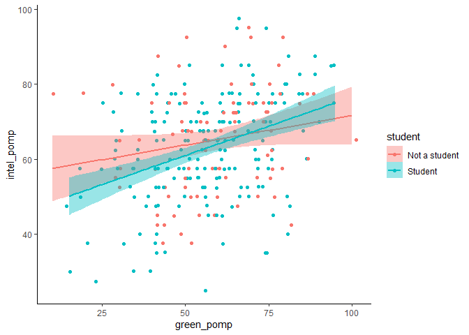
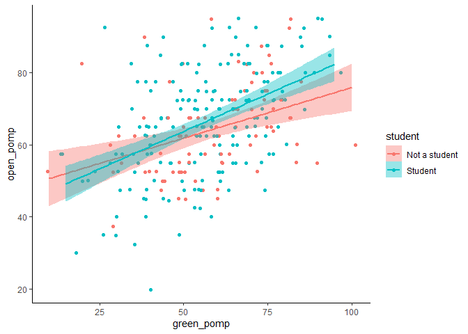

hw03
================
Greg Rousis
2/18/2021

# Homework 03

You will analyze data looking at the relationship between **green
reputation** and three personality traits–**compassion**, **intellectual
curiosity**, and **openness to experiences**. The dataset includes data
from **students** and **non-students**.

``` r
dictionary <- readr::read_csv("green_dictionary.csv")
```

    ## 
    ## -- Column specification --------------------------------------------------------
    ## cols(
    ##   Item = col_character(),
    ##   Content = col_character(),
    ##   Options = col_character(),
    ##   Keying = col_double()
    ## )

``` r
green_data <- readr::read_csv("green_data.csv")
```

    ## 
    ## -- Column specification --------------------------------------------------------
    ## cols(
    ##   .default = col_double(),
    ##   id = col_character()
    ## )
    ## i Use `spec()` for the full column specifications.

``` r
print(dictionary, n = 36)
```

    ## # A tibble: 36 x 4
    ##    Item    Content                                      Options           Keying
    ##    <chr>   <chr>                                        <chr>              <dbl>
    ##  1 green1  Overall, I am regarded as an environmentall~ 1-5; SD, D, NAD,~      1
    ##  2 green2  I am not particularly known for protecting ~ 1-5; SD, D, NAD,~     -2
    ##  3 green3  My friends know I enjoy nature.              1-5; SD, D, NAD,~      1
    ##  4 green4  I have a reputation for living in harmony w~ 1-5; SD, D, NAD,~      1
    ##  5 green5  Among people I know, I seem to be the one m~ 1-5; SD, D, NAD,~      1
    ##  6 comp1   I feel others' emotions.                     1-5; SD, D, NAD,~      1
    ##  7 comp2   I inquire about others' well-being.          1-5; SD, D, NAD,~      1
    ##  8 comp3   I sympathize with others' feelings.          1-5; SD, D, NAD,~      1
    ##  9 comp4   I take an interest in other people's lives.  1-5; SD, D, NAD,~      1
    ## 10 comp5   I like to do things for others.              1-5; SD, D, NAD,~      1
    ## 11 comp6   I am not interested in other people's probl~ 1-5; SD, D, NAD,~     -1
    ## 12 comp7   I can't be bothered with others' needs.      1-5; SD, D, NAD,~     -1
    ## 13 comp8   I am indifferent to the feelings of others.  1-5; SD, D, NAD,~     -1
    ## 14 comp9   I take no time for others.                   1-5; SD, D, NAD,~     -1
    ## 15 comp10  I don't have a soft side.                    1-5; SD, D, NAD,~     -1
    ## 16 intel1  I am quick to understand things.             1-5; SD, D, NAD,~      1
    ## 17 intel2  I can handle a lot of information.           1-5; SD, D, NAD,~      1
    ## 18 intel3  I like to solve complex problems.            1-5; SD, D, NAD,~      1
    ## 19 intel4  I have a rich vocabulary.                    1-5; SD, D, NAD,~      1
    ## 20 intel5  I think quickly.                             1-5; SD, D, NAD,~      1
    ## 21 intel6  I formulate ideas clearly.                   1-5; SD, D, NAD,~      1
    ## 22 intel7  I have difficulty understanding abstract id~ 1-5; SD, D, NAD,~     -1
    ## 23 intel8  I avoid philosophical discussions.           1-5; SD, D, NAD,~     -1
    ## 24 intel9  I avoid difficult reading material.          1-5; SD, D, NAD,~     -1
    ## 25 intel10 I learn things slowly.                       1-5; SD, D, NAD,~     -1
    ## 26 open1   I enjoy the beauty of nature.                1-5; SD, D, NAD,~      1
    ## 27 open2   I believe in the importance of art.          1-5; SD, D, NAD,~      1
    ## 28 open3   I love to reflect on things.                 1-5; SD, D, NAD,~      1
    ## 29 open4   I get deeply immersed in music.              1-5; SD, D, NAD,~      1
    ## 30 open5   I see beauty in things that others might no~ 1-5; SD, D, NAD,~      1
    ## 31 open6   I need a creative outlet.                    1-5; SD, D, NAD,~      1
    ## 32 open7   I do not like poetry.                        1-5; SD, D, NAD,~     -1
    ## 33 open8   I seldom get lost in thought.                1-5; SD, D, NAD,~     -1
    ## 34 open9   I seldom daydream.                           1-5; SD, D, NAD,~     -1
    ## 35 open10  I seldom notice the emotional aspects of pa~ 1-5; SD, D, NAD,~     -1
    ## 36 student student                                      1 not a student;~     NA

# Question 1: inspect item responses

1.  Inspect the item responses (e.g., with graphs or by summarizing
    distinct values). Is anything unusual?

<!-- end list -->

``` r
green_data %>% 
  summary()
```

    ##       id                green1          green2         green3     
    ##  Length:373         Min.   :1.000   Min.   :1.00   Min.   :1.000  
    ##  Class :character   1st Qu.:3.000   1st Qu.:2.00   1st Qu.:3.000  
    ##  Mode  :character   Median :4.000   Median :3.00   Median :4.000  
    ##                     Mean   :3.476   Mean   :2.93   Mean   :3.797  
    ##                     3rd Qu.:4.000   3rd Qu.:4.00   3rd Qu.:4.000  
    ##                     Max.   :5.000   Max.   :5.00   Max.   :5.000  
    ##                     NA's   :58      NA's   :58     NA's   :58     
    ##      green4          green5          comp1             comp2        
    ##  Min.   :1.000   Min.   :1.000   Min.   :-99.000   Min.   :-99.000  
    ##  1st Qu.:3.000   1st Qu.:2.000   1st Qu.:  4.000   1st Qu.:  4.000  
    ##  Median :3.000   Median :3.000   Median :  4.000   Median :  4.000  
    ##  Mean   :3.238   Mean   :2.835   Mean   :  3.648   Mean   :  3.702  
    ##  3rd Qu.:4.000   3rd Qu.:4.000   3rd Qu.:  4.000   3rd Qu.:  4.500  
    ##  Max.   :5.000   Max.   :5.000   Max.   :  5.000   Max.   :  5.000  
    ##  NA's   :58      NA's   :58      NA's   :86        NA's   :78       
    ##      comp3           comp4             comp5             comp6      
    ##  Min.   :1.000   Min.   :-99.000   Min.   :-99.000   Min.   :1.000  
    ##  1st Qu.:4.000   1st Qu.:  4.000   1st Qu.:  4.000   1st Qu.:2.000  
    ##  Median :4.000   Median :  4.000   Median :  4.000   Median :2.000  
    ##  Mean   :4.267   Mean   :  3.691   Mean   :  3.319   Mean   :2.161  
    ##  3rd Qu.:5.000   3rd Qu.:  4.000   3rd Qu.:  4.000   3rd Qu.:3.000  
    ##  Max.   :5.000   Max.   :  5.000   Max.   :  5.000   Max.   :5.000  
    ##  NA's   :77      NA's   :85        NA's   :88        NA's   :81     
    ##      comp7            comp8             comp9             comp10       
    ##  Min.   :-99.00   Min.   :-99.000   Min.   :-99.000   Min.   :-99.000  
    ##  1st Qu.:  2.00   1st Qu.:  2.000   1st Qu.:  2.000   1st Qu.:  1.000  
    ##  Median :  2.00   Median :  2.000   Median :  2.000   Median :  2.000  
    ##  Mean   :  1.84   Mean   :  1.739   Mean   :  1.342   Mean   :  1.577  
    ##  3rd Qu.:  3.00   3rd Qu.:  2.000   3rd Qu.:  2.000   3rd Qu.:  2.000  
    ##  Max.   :  5.00   Max.   :  5.000   Max.   :  5.000   Max.   :  5.000  
    ##  NA's   :86       NA's   :90        NA's   :89        NA's   :89       
    ##      intel1           intel2            intel3            intel4       
    ##  Min.   :-99.00   Min.   :-99.000   Min.   :-99.000   Min.   :-99.000  
    ##  1st Qu.:  3.00   1st Qu.:  3.000   1st Qu.:  3.000   1st Qu.:  3.000  
    ##  Median :  4.00   Median :  4.000   Median :  4.000   Median :  4.000  
    ##  Mean   :  3.38   Mean   :  3.336   Mean   :  2.822   Mean   :  2.656  
    ##  3rd Qu.:  4.00   3rd Qu.:  4.000   3rd Qu.:  4.000   3rd Qu.:  4.000  
    ##  Max.   :  5.00   Max.   :  5.000   Max.   :  5.000   Max.   :  5.000  
    ##  NA's   :78       NA's   :90        NA's   :86        NA's   :88       
    ##      intel5            intel6            intel7            intel8       
    ##  Min.   :-99.000   Min.   :-99.000   Min.   :-99.000   Min.   :-99.000  
    ##  1st Qu.:  3.000   1st Qu.:  3.000   1st Qu.:  2.000   1st Qu.:  2.000  
    ##  Median :  4.000   Median :  4.000   Median :  2.000   Median :  2.000  
    ##  Mean   :  3.378   Mean   :  3.211   Mean   :  2.101   Mean   :  2.125  
    ##  3rd Qu.:  4.000   3rd Qu.:  4.000   3rd Qu.:  3.000   3rd Qu.:  3.000  
    ##  Max.   :  5.000   Max.   :  5.000   Max.   :  5.000   Max.   :  5.000  
    ##  NA's   :77        NA's   :89        NA's   :86        NA's   :78       
    ##      intel9           intel10            open1             open2        
    ##  Min.   :-99.000   Min.   :-99.000   Min.   :-99.000   Min.   :-99.000  
    ##  1st Qu.:  2.000   1st Qu.:  2.000   1st Qu.:  4.000   1st Qu.:  3.000  
    ##  Median :  2.000   Median :  2.000   Median :  4.000   Median :  4.000  
    ##  Mean   :  2.014   Mean   :  1.809   Mean   :  3.894   Mean   :  3.411  
    ##  3rd Qu.:  4.000   3rd Qu.:  3.000   3rd Qu.:  5.000   3rd Qu.:  4.000  
    ##  Max.   :  5.000   Max.   :  5.000   Max.   :  5.000   Max.   :  5.000  
    ##  NA's   :90        NA's   :90        NA's   :81        NA's   :81       
    ##      open3             open4             open5             open6        
    ##  Min.   :-99.000   Min.   :-99.000   Min.   :-99.000   Min.   :-99.000  
    ##  1st Qu.:  3.000   1st Qu.:  3.000   1st Qu.:  3.000   1st Qu.:  3.000  
    ##  Median :  4.000   Median :  4.000   Median :  4.000   Median :  4.000  
    ##  Mean   :  3.387   Mean   :  3.562   Mean   :  3.109   Mean   :  2.882  
    ##  3rd Qu.:  4.000   3rd Qu.:  5.000   3rd Qu.:  4.000   3rd Qu.:  4.000  
    ##  Max.   :  5.000   Max.   :  5.000   Max.   :  5.000   Max.   :  5.000  
    ##  NA's   :89        NA's   :85        NA's   :88        NA's   :84       
    ##      open7             open8           open9           open10      
    ##  Min.   :-99.000   Min.   :1.000   Min.   :1.000   Min.   :-99.00  
    ##  1st Qu.:  2.000   1st Qu.:2.000   1st Qu.:2.000   1st Qu.:  2.00  
    ##  Median :  3.000   Median :2.000   Median :2.000   Median :  2.00  
    ##  Mean   :  2.274   Mean   :2.599   Mean   :2.568   Mean   :  2.36  
    ##  3rd Qu.:  4.000   3rd Qu.:3.000   3rd Qu.:4.000   3rd Qu.:  4.00  
    ##  Max.   :  5.000   Max.   :5.000   Max.   :5.000   Max.   :  5.00  
    ##  NA's   :85        NA's   :84      NA's   :77      NA's   :90      
    ##     student       
    ##  Min.   :-99.000  
    ##  1st Qu.:  1.000  
    ##  Median :  2.000  
    ##  Mean   :  1.309  
    ##  3rd Qu.:  2.000  
    ##  Max.   :  2.000  
    ##  NA's   :95

### There are some -99’s, which need to be recoded as missing

``` r
green_data <- green_data %>% 
  mutate_at(vars(comp1:student),
            ~ifelse(. == -99, NA, .)
  )

green_data %>% 
  summary()
```

    ##       id                green1          green2         green3     
    ##  Length:373         Min.   :1.000   Min.   :1.00   Min.   :1.000  
    ##  Class :character   1st Qu.:3.000   1st Qu.:2.00   1st Qu.:3.000  
    ##  Mode  :character   Median :4.000   Median :3.00   Median :4.000  
    ##                     Mean   :3.476   Mean   :2.93   Mean   :3.797  
    ##                     3rd Qu.:4.000   3rd Qu.:4.00   3rd Qu.:4.000  
    ##                     Max.   :5.000   Max.   :5.00   Max.   :5.000  
    ##                     NA's   :58      NA's   :58     NA's   :58     
    ##      green4          green5          comp1           comp2      
    ##  Min.   :1.000   Min.   :1.000   Min.   :1.000   Min.   :1.000  
    ##  1st Qu.:3.000   1st Qu.:2.000   1st Qu.:4.000   1st Qu.:4.000  
    ##  Median :3.000   Median :3.000   Median :4.000   Median :4.000  
    ##  Mean   :3.238   Mean   :2.835   Mean   :4.007   Mean   :4.051  
    ##  3rd Qu.:4.000   3rd Qu.:4.000   3rd Qu.:4.000   3rd Qu.:4.750  
    ##  Max.   :5.000   Max.   :5.000   Max.   :5.000   Max.   :5.000  
    ##  NA's   :58      NA's   :58      NA's   :87      NA's   :79     
    ##      comp3           comp4           comp5           comp6      
    ##  Min.   :1.000   Min.   :1.000   Min.   :1.000   Min.   :1.000  
    ##  1st Qu.:4.000   1st Qu.:4.000   1st Qu.:4.000   1st Qu.:2.000  
    ##  Median :4.000   Median :4.000   Median :4.000   Median :2.000  
    ##  Mean   :4.267   Mean   :4.049   Mean   :4.042   Mean   :2.161  
    ##  3rd Qu.:5.000   3rd Qu.:4.000   3rd Qu.:4.000   3rd Qu.:3.000  
    ##  Max.   :5.000   Max.   :5.000   Max.   :5.000   Max.   :5.000  
    ##  NA's   :77      NA's   :86      NA's   :90      NA's   :81     
    ##      comp7           comp8           comp9           comp10     
    ##  Min.   :1.000   Min.   :1.000   Min.   :1.000   Min.   :1.000  
    ##  1st Qu.:2.000   1st Qu.:2.000   1st Qu.:2.000   1st Qu.:1.000  
    ##  Median :2.000   Median :2.000   Median :2.000   Median :2.000  
    ##  Mean   :2.192   Mean   :2.096   Mean   :2.053   Mean   :1.933  
    ##  3rd Qu.:3.000   3rd Qu.:2.000   3rd Qu.:2.000   3rd Qu.:2.000  
    ##  Max.   :5.000   Max.   :5.000   Max.   :5.000   Max.   :5.000  
    ##  NA's   :87      NA's   :91      NA's   :91      NA's   :90     
    ##      intel1          intel2          intel3          intel4     
    ##  Min.   :1.000   Min.   :1.000   Min.   :1.000   Min.   :1.000  
    ##  1st Qu.:3.000   1st Qu.:3.000   1st Qu.:3.000   1st Qu.:3.000  
    ##  Median :4.000   Median :4.000   Median :4.000   Median :4.000  
    ##  Mean   :3.728   Mean   :3.699   Mean   :3.537   Mean   :3.375  
    ##  3rd Qu.:4.000   3rd Qu.:4.000   3rd Qu.:4.000   3rd Qu.:4.000  
    ##  Max.   :5.000   Max.   :5.000   Max.   :5.000   Max.   :5.000  
    ##  NA's   :79      NA's   :91      NA's   :88      NA's   :90     
    ##      intel5          intel6          intel7          intel8     
    ##  Min.   :1.000   Min.   :1.000   Min.   :1.000   Min.   :1.000  
    ##  1st Qu.:3.000   1st Qu.:3.000   1st Qu.:2.000   1st Qu.:2.000  
    ##  Median :4.000   Median :4.000   Median :2.000   Median :2.000  
    ##  Mean   :3.725   Mean   :3.572   Mean   :2.455   Mean   :2.469  
    ##  3rd Qu.:4.000   3rd Qu.:4.000   3rd Qu.:3.000   3rd Qu.:3.000  
    ##  Max.   :5.000   Max.   :5.000   Max.   :5.000   Max.   :5.000  
    ##  NA's   :78      NA's   :90      NA's   :87      NA's   :79     
    ##      intel9         intel10          open1           open2      
    ##  Min.   :1.000   Min.   :1.000   Min.   :1.000   Min.   :1.000  
    ##  1st Qu.:2.000   1st Qu.:2.000   1st Qu.:4.000   1st Qu.:3.000  
    ##  Median :2.000   Median :2.000   Median :4.000   Median :4.000  
    ##  Mean   :2.733   Mean   :2.527   Mean   :4.247   Mean   :3.763  
    ##  3rd Qu.:4.000   3rd Qu.:3.000   3rd Qu.:5.000   3rd Qu.:4.000  
    ##  Max.   :5.000   Max.   :5.000   Max.   :5.000   Max.   :5.000  
    ##  NA's   :92      NA's   :92      NA's   :82      NA's   :82     
    ##      open3           open4          open5          open6           open7      
    ##  Min.   :1.000   Min.   :1.00   Min.   :1.00   Min.   :1.000   Min.   :1.000  
    ##  1st Qu.:3.000   1st Qu.:3.00   1st Qu.:3.00   1st Qu.:3.000   1st Qu.:2.000  
    ##  Median :4.000   Median :4.00   Median :4.00   Median :4.000   Median :3.000  
    ##  Mean   :3.749   Mean   :3.92   Mean   :3.83   Mean   :3.592   Mean   :2.983  
    ##  3rd Qu.:4.000   3rd Qu.:5.00   3rd Qu.:4.00   3rd Qu.:4.000   3rd Qu.:4.000  
    ##  Max.   :5.000   Max.   :5.00   Max.   :5.00   Max.   :5.000   Max.   :5.000  
    ##  NA's   :90      NA's   :86     NA's   :90     NA's   :86      NA's   :87     
    ##      open8           open9           open10        student     
    ##  Min.   :1.000   Min.   :1.000   Min.   :1.00   Min.   :1.000  
    ##  1st Qu.:2.000   1st Qu.:2.000   1st Qu.:2.00   1st Qu.:1.000  
    ##  Median :2.000   Median :2.000   Median :2.00   Median :2.000  
    ##  Mean   :2.599   Mean   :2.568   Mean   :2.72   Mean   :1.671  
    ##  3rd Qu.:3.000   3rd Qu.:4.000   3rd Qu.:4.00   3rd Qu.:2.000  
    ##  Max.   :5.000   Max.   :5.000   Max.   :5.00   Max.   :2.000  
    ##  NA's   :84      NA's   :77      NA's   :91     NA's   :96

``` r
green_data <- 
  green_data %>% 
  mutate(student = factor(student, levels = c(1, 2))) %>% 
  mutate(
    student = recode(student, "1" = "Not a student", "2" = "Student")
  )

  
melt.green <- melt(green_data)
```

    ## Using id, student as id variables

``` r
head(melt.green)
```

    ##     id student variable value
    ## 1 9099 Student   green1     4
    ## 2 6275 Student   green1     3
    ## 3 8116 Student   green1     4
    ## 4 8586 Student   green1     4
    ## 5 0406 Student   green1     3
    ## 6 5645 Student   green1     4

``` r
ggplot(melt.green) +
  aes(x = value) +
  geom_histogram() +
  facet_wrap(~variable, 
             scales = "free")
```

    ## `stat_bin()` using `bins = 30`. Pick better value with `binwidth`.

    ## Warning: Removed 2870 rows containing non-finite values (stat_bin).

<!-- -->

# Question 2: compute total scores

2.  Compute total scores for the four scales. Recode variables as
    needed.

<!-- end list -->

``` r
# pull the reverse-coded items from the dictionary
reversed <- dictionary %>%
  filter(Keying <= 0) %>%
  pull(Item)

#recode to match direction of other items

green_data <- green_data %>%
  mutate(
    across(all_of(reversed),
           ~  6-.x,
           .names = "{.col}r")
  )

green_data %>% 
  select(green2, green2r)
```

    ## # A tibble: 373 x 2
    ##    green2 green2r
    ##     <dbl>   <dbl>
    ##  1      2       4
    ##  2      5       1
    ##  3      2       4
    ##  4      3       3
    ##  5      2       4
    ##  6      3       3
    ##  7      1       5
    ##  8      3       3
    ##  9      2       4
    ## 10      2       4
    ## # ... with 363 more rows

``` r
# compute total scores

green_data <- 
  green_data %>% 
  rowwise() %>% 
  mutate(green_tot = mean(c(green1, green2r, green3, green4, green5), na.rm = TRUE),
         comp_tot = mean(c(comp1, comp2, comp3, comp4, comp5, comp6r, comp7r, comp8r, comp9r, comp10r), 
                         na.rm = TRUE),
         intel_tot = mean(c(intel1, intel2, intel3, intel4, intel5, intel6, intel7r, intel8r, intel9r, intel10r),
                          na.rm = TRUE),
         open_tot = mean(c(open1, open2, open3, open4, open5, open6, open7r, open8r, open9r, open10r), 
                         na.rm = TRUE)) %>% 
  ungroup()
```

# Question 3: Rescaling using POMP

3.  Rescale the variables so that they go from 0-100 instead of the
    original range. Name the recaled variables `*_pomp`.

<!-- end list -->

``` r
# computing pomp scores (100*(raw-min)/(max-min))

green_data <- 
  green_data %>%
  rowwise() %>% 
  mutate(green_pomp = (100*(green_tot - 1))/(5-1), na.rm = TRUE,
         comp_pomp = (100*(comp_tot - 1))/(5-1), na.rm = TRUE,
         intel_pomp = (100*(intel_tot - 1))/(5-1), na.rm = TRUE,
         open_pomp = (100*(open_tot - 1))/(5-1), na.rm = TRUE) %>% 
  ungroup()
```

# Question 4: distribution plots

4.  Make plots that illustrate the distributions of the 4 POMP-scored
    variables.

<!-- end list -->

``` r
ggplot(green_data) +
  aes(x = green_pomp) +
  geom_bar()
```

    ## Warning: Removed 58 rows containing non-finite values (stat_count).

<!-- -->

``` r
ggplot(green_data) +
  aes(x = comp_pomp) +
  geom_histogram(binwidth = 1.5)
```

    ## Warning: Removed 77 rows containing non-finite values (stat_bin).

<!-- -->

``` r
ggplot(green_data) +
  aes(x = intel_pomp) +
  geom_bar()
```

    ## Warning: Removed 77 rows containing non-finite values (stat_count).

<!-- -->

``` r
ggplot(green_data) +
  aes(x = open_pomp) +
  geom_bar()
```

    ## Warning: Removed 77 rows containing non-finite values (stat_count).

<!-- -->

# Question 5: scatterplots

5.  Make scatterplots showing the relationships between **green
    reputation** and each personality trait. Include trend lines for
    **students** and **non-students**. What do these plots show?

**Answer:** green reputation is positively correlated with all 3
personality variables. However, the association appears to differ
between students and non-students. Compassion is positively associated
with green reputation among both students and non-students, but students
appear to report higher mean levels of compassion than non-students.
Green reputation is positively associated with intellectual curiosity
among students, but seems to have little association with intellectual
curiosity among non-students. Likewise, the association between green
repuatation and openness is seemingly stronger among students than
non-students.

``` r
green_data %>% 
  filter(!is.na(student)) %>% 
  ggplot() +
  aes(y = comp_pomp,
      x = green_pomp,
      group = student,
      color = student,
      fill = student) +
  geom_jitter() +
  geom_smooth(method = "lm")
```

    ## `geom_smooth()` using formula 'y ~ x'

<!-- -->

``` r
green_data %>% 
  filter(!is.na(student)) %>% 
  ggplot() +
  aes(y = intel_pomp,
      x = green_pomp,
      group = student,
      color = student,
      fill = student) +
  geom_jitter() +
  geom_smooth(method = "lm")
```

    ## `geom_smooth()` using formula 'y ~ x'

<!-- -->

``` r
green_data %>% 
  filter(!is.na(student)) %>% 
  ggplot() +
  aes(y = open_pomp,
      x = green_pomp,
      group = student,
      color = student,
      fill = student) +
  geom_jitter() +
  geom_smooth(method = "lm")
```

    ## `geom_smooth()` using formula 'y ~ x'

<!-- -->

# Question 6: rainfall plots

6.  Compare **green reputation** for students and non-students using a
    **rainfall plot** (bar + density + data points).

**answer:** Non-students appear to have a bimodal distribution of green
reputation: one mode is around 50 (out of 100) and another around 75
(out of 100). For students, green reputation resembles a more normal
distribution.

``` r
green_data %>% 
  filter(!is.na(student)) %>% 
ggplot() +
  aes(y = student,
      x = green_pomp,
      fill = student,
      color = student) +
  geom_jitter(height = .15) +
  geom_boxplot(color = "black",
               alpha = .5,
               width = .1,
               size = .5) +
  ggdist::stat_slab(height = .3,
                    color = "black",
                    size = .2,
                    alpha = .5,
                    position = position_nudge(y = .2))
```

<!-- -->

# Question 7: summary table

7.  Compute a summary table of means, SDs, medians, minima, and maxima
    for the four total scores for students and non-students.

<!-- end list -->

``` r
tab <- green_data %>% 
  na.omit() %>% 
  group_by(student) %>% 
  summarize(mean_green = mean(green_pomp),
            sd_green = sd(green_pomp),
            median_green = median(green_pomp),
            min_green = min(green_pomp),
            max_green = max(green_pomp),
            mean_comp = mean(comp_pomp),
            sd_comp = sd(comp_pomp),
            median_comp = median(comp_pomp),
            min_comp = min(comp_pomp),
            max_comp = max(comp_pomp),
            mean_intel = mean(intel_pomp),
            sd_intel = sd(intel_pomp),
            median_intel = median(intel_pomp),
            min_intel = min(intel_pomp),
            max_intel = max(intel_pomp),
            mean_open = mean(open_pomp),
            sd_open = sd(open_pomp),
            median_open = median(open_pomp),
            min_open = min(open_pomp),
            max_open = max(open_pomp))

tab %>% 
  kable(caption = "Summary Statistics")
```

<table>

<caption>

Summary Statistics

</caption>

<thead>

<tr>

<th style="text-align:left;">

student

</th>

<th style="text-align:right;">

mean\_green

</th>

<th style="text-align:right;">

sd\_green

</th>

<th style="text-align:right;">

median\_green

</th>

<th style="text-align:right;">

min\_green

</th>

<th style="text-align:right;">

max\_green

</th>

<th style="text-align:right;">

mean\_comp

</th>

<th style="text-align:right;">

sd\_comp

</th>

<th style="text-align:right;">

median\_comp

</th>

<th style="text-align:right;">

min\_comp

</th>

<th style="text-align:right;">

max\_comp

</th>

<th style="text-align:right;">

mean\_intel

</th>

<th style="text-align:right;">

sd\_intel

</th>

<th style="text-align:right;">

median\_intel

</th>

<th style="text-align:right;">

min\_intel

</th>

<th style="text-align:right;">

max\_intel

</th>

<th style="text-align:right;">

mean\_open

</th>

<th style="text-align:right;">

sd\_open

</th>

<th style="text-align:right;">

median\_open

</th>

<th style="text-align:right;">

min\_open

</th>

<th style="text-align:right;">

max\_open

</th>

</tr>

</thead>

<tbody>

<tr>

<td style="text-align:left;">

Not a student

</td>

<td style="text-align:right;">

58.35294

</td>

<td style="text-align:right;">

16.73299

</td>

<td style="text-align:right;">

60

</td>

<td style="text-align:right;">

10

</td>

<td style="text-align:right;">

100

</td>

<td style="text-align:right;">

70.91176

</td>

<td style="text-align:right;">

13.33992

</td>

<td style="text-align:right;">

75.0

</td>

<td style="text-align:right;">

40.0

</td>

<td style="text-align:right;">

100

</td>

<td style="text-align:right;">

65.00000

</td>

<td style="text-align:right;">

13.97276

</td>

<td style="text-align:right;">

67.5

</td>

<td style="text-align:right;">

37.5

</td>

<td style="text-align:right;">

95.0

</td>

<td style="text-align:right;">

64.05882

</td>

<td style="text-align:right;">

12.64191

</td>

<td style="text-align:right;">

62.5

</td>

<td style="text-align:right;">

37.5

</td>

<td style="text-align:right;">

95

</td>

</tr>

<tr>

<td style="text-align:left;">

Student

</td>

<td style="text-align:right;">

56.62921

</td>

<td style="text-align:right;">

17.14470

</td>

<td style="text-align:right;">

55

</td>

<td style="text-align:right;">

15

</td>

<td style="text-align:right;">

95

</td>

<td style="text-align:right;">

77.80899

</td>

<td style="text-align:right;">

14.22588

</td>

<td style="text-align:right;">

77.5

</td>

<td style="text-align:right;">

22.5

</td>

<td style="text-align:right;">

100

</td>

<td style="text-align:right;">

63.03371

</td>

<td style="text-align:right;">

14.41648

</td>

<td style="text-align:right;">

65.0

</td>

<td style="text-align:right;">

25.0

</td>

<td style="text-align:right;">

97.5

</td>

<td style="text-align:right;">

66.74157

</td>

<td style="text-align:right;">

14.93349

</td>

<td style="text-align:right;">

67.5

</td>

<td style="text-align:right;">

20.0

</td>

<td style="text-align:right;">

95

</td>

</tr>

</tbody>

</table>

In your assignment, prepare an RMarkdown file that includes both the
coding and (for 4-7) narrative descriptions of your results.
