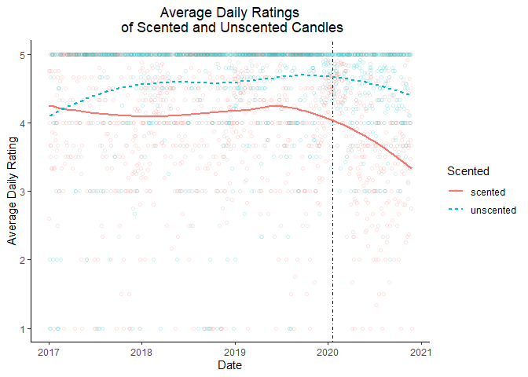
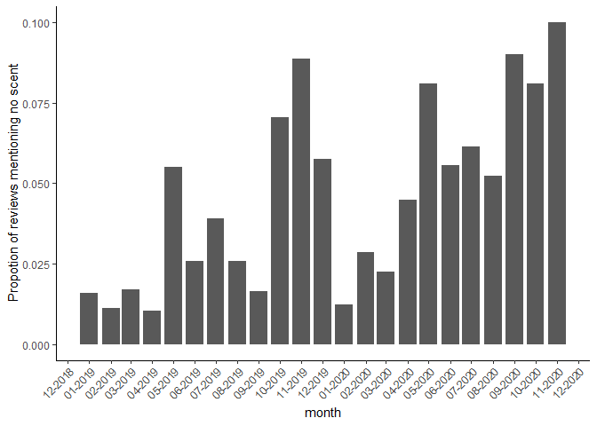

Consequences of Covid-19 for Candle Critiques
================
Greg Rousis
Mar 29 2021

## The data

There are 2 datasets in this report: one for people’s reviews of scented
candles and one for reviews of unscented candles. The datasets have the
following variables:

1.  `CandleID`: A numeric id variable for candle 1-3 in each category.
2.  `Date`: The date of the review.
3.  `Rating`: The 1-5 rating for the review.
4.  `Review`: For the scented candles, the text of the review.

## Part 1: Average daily ratings for scented and unscented candles

Since the onset of COVID, average ratings for scented candles have
dropped preciptiously, whereas those for unscented ccandles have
remained relatively stable.

``` r
p1 <- candles_scented %>% 
  filter(Date >= "2017-01-01") %>% 
  group_by(Date) %>% 
  mutate(Rating_Avg = mean(Rating)) %>%
  distinct(Date,
           .keep_all = TRUE) %>% 
  ggplot() +
  aes(x = Date,
      y = Rating_Avg) +
  geom_point(shape = 1, 
             alpha = 0.2) +
  geom_vline(xintercept = as.POSIXct(as.Date("2020-01-20")),
             linetype = 4) +
  geom_smooth(method = "loess") +
  scale_x_datetime(date_breaks = "6 months",
                   date_labels = "%m-%Y") +
  ylab(label = "Average Daily Rating")+
  theme(axis.text.x = element_text(angle = 45, hjust = 1))+
  ggtitle(label = "Average Daily Ratings\n of Scented Candles") +
  theme(plot.title = element_text(hjust = 0.5))


p2 <- candles_unscented %>% 
  filter(Date >= "2017-01-01") %>% 
  group_by(Date) %>% 
  mutate(Rating_Avg = mean(Rating)) %>%
  distinct(Date,
           .keep_all = TRUE) %>% 
  ggplot() +
  aes(x = Date,
      y = Rating_Avg) +
  geom_vline(xintercept = as.numeric(as.Date("2020-01-20"))) +
  geom_vline(xintercept = as.POSIXct(as.Date("2020-01-20")),
             linetype = 4) +
  geom_point(shape = 1,
             alpha = 0.2) +
  geom_smooth(method = "loess") +
  scale_x_datetime(date_breaks = "6 months",
                   date_labels = "%m-%Y") +
  scale_fill_brewer() +
  ylab(label = "Average Daily Rating")+
  theme(axis.text.x = element_text(angle = 45, hjust = 1)) +
  ggtitle(label = "Average Daily Ratings\n of Unscented Candles") +
  theme(plot.title = element_text(hjust = 0.5))


p1 + p2
```

    ## `geom_smooth()` using formula 'y ~ x'
    ## `geom_smooth()` using formula 'y ~ x'

<!-- -->

## Part 2: Combined plot

``` r
candles_full <- bind_rows(
    scented = candles_scented, 
    unscented = candles_unscented, 
    .id = "Scented"
)
```

``` r
candles_full <- bind_rows(
    scented = candles_scented, 
    unscented = candles_unscented, 
    .id = "Scented"
)

full_filtered <- candles_full %>% 
  filter(Date >= "2017-01-01") %>% 
  group_by(Date, Scented) %>% 
  mutate(Rating_Avg = mean(Rating)) %>%
  distinct(Date,
           .keep_all = TRUE)

ggplot(full_filtered) +
  aes(x = Date,
      y = Rating_Avg,
      color = Scented,
      group = Scented,
      linetype = Scented) +
  geom_vline(xintercept = as.POSIXct(as.Date("2020-01-20")),
             linetype = 4) +
  geom_point(shape = 1,
             alpha = 0.2)+
  geom_smooth(method = "loess",
              se = FALSE) +
  ylab(label = "Average Daily Rating") +
  ggtitle(label = "Average Daily Ratings\n of Scented and Unscented Candles") +
  theme(plot.title = element_text(hjust = 0.5))
```

    ## `geom_smooth()` using formula 'y ~ x'

<!-- -->

Which of these two sets of plots do you find easier to interpret?

I think both tell the story that scented candles started performing
worse once COVID and its attendant olfactory effects kicked in, athough
it’s easier to see the relative trend when both scented and unscented
reviews are in the same graph.

## Part 3: Proportion of reviews mentioning “no scent”

Looking at the content of people’s reviews, it appears that a lot of
complaints came in the winter months of 2019 (cold and flu season), but
are much more consistent in 2020, likely reflecting the impact of COVID.
Furtermore, the trend if people complaining that they can’t smell their
candles appears to mirror the occurrence of allergy season, cold and flu
season, and then the onset of COVID.

It also looks like the proportion of people complaining that their
candles don’t smell is larger in 2020 moths relative to 2019.

``` r
candles_scented %>% 
  filter(Date > "2019-01-01", Date < "2021-01-01") %>% 
  mutate(month = lubridate::floor_date(Date, "month")) %>% 
  mutate(noscent = str_no_scent(Review)) %>% 
  group_by(month, noscent) %>% 
  summarize(n = n()) %>% 
  mutate(prop = n/sum(n)) %>% 
  filter(noscent == 1) %>% 
  ggplot() +
  aes(x = month,
      y = prop) +
  geom_bar(stat = "identity") +
  scale_x_datetime(date_breaks = "1 month",
                   date_labels = "%m-%Y") +
  theme(axis.text.x = element_text(angle = 45, hjust = 1)) +
  ylab(label = "Propotion of reviews mentioning no scent")
```

    ## `summarise()` has grouped output by 'month'. You can override using the `.groups` argument.

<!-- -->
