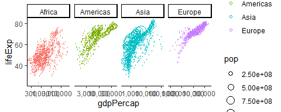
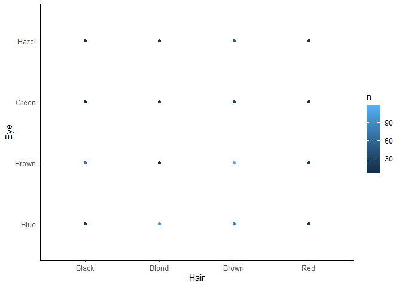

ggplot2 exercises: Fix the plots
================

In this worksheet, we’ll be looking at some problematic plots and fixing
them.

I think you might not have these two packages installed:

    install.packages("ggridges")
    install.packages("scales")

The exercises below include some data wrangling function. It’s okay if
you aren’t familiar with them all yet\! We will get into a lot of them
over the next few weeks, but see if you can figure out what they are
doing as you go.

``` r
library(tidyverse)
library(gapminder)
library(ggridges)
library(scales)
theme_set(theme_classic())
```

<!-- The following chunk allows errors when knitting -->

## Exercise 1: Overlapping Points

Fix the overlapping data points problem in the following plot using each
of these solutions:

1.  Adding an `alpha` argument
2.  Adding a `size` argument
3.  Jittering the points

<!-- end list -->

``` r
ggplot(mpg) +
  aes(cty, hwy) +
  geom_point()
```

<!-- -->

``` r
#adding alpha
ggplot(mpg) +
  aes(cty, hwy) +
  geom_point(alpha = 0.2)
```

<!-- -->

``` r
#adding size

ggplot(mpg) +
  aes(cty, hwy) +
  geom_point(size = .5)
```

<!-- -->

``` r
#using jitter instead of point

ggplot(mpg) +
  aes(cty, hwy) +
  geom_jitter(height = 0, 
              width = .7)
```

<!-- -->

## Exercise 2: Line for each Country

Fix this plot so that it shows life expectancy over time with a separate
line *for each country*. ggplot(gapminder) +

``` r
ggplot(gapminder) +
  aes(year, lifeExp) +
  geom_line()
```

<!-- -->

``` r
#separating by country

ggplot(gapminder) +
  aes(x = year, 
      y = lifeExp,
      group = country) +
  geom_line()
```

<!-- -->

## Exercise 3: More gdpPercap vs lifeExp

### 3(a) Facets

  - Change the x-axis text to be in “comma format” with
    `scales::comma_format()`.
  - Separate each continent into sub-panels.

<!-- end list -->

``` r
ggplot(gapminder) +
  aes(x = gdpPercap, 
      y = lifeExp) +
  geom_point(alpha = 0.2) +
  scale_x_log10()
```

<!-- -->

``` r
#adding comma format and faceting by continent

ggplot(gapminder) +
  aes(x = gdpPercap, 
      y = lifeExp) +
  geom_point(alpha = 0.2) +
  scale_x_log10(label = comma)+
  facet_grid(col = vars(continent))
```

<!-- -->

### 3(b) Bubble Plot

  - Put the plots in one row, and free up the axes (let them have
    different scales).
  - Make a bubble plot by making the size of the points proportional to
    population.
      - Try adding a `scale_size_area()` layer too
  - Use `shape=21` to distinguish between `fill` (interior) and `color`
    (exterior).

<!-- end list -->

``` r
gapminder_noOceania <- filter(gapminder, continent != "Oceania")

ggplot(gapminder_noOceania) +
  aes(gdpPercap, lifeExp) +
  facet_wrap(~ continent) +
  geom_point(alpha = 0.2) +
  scale_x_log10(labels = scales::comma_format())
```

<!-- -->

``` r
#putting plots in one row, freeing up the axes, and making bubble plot based on pop size

ggplot(gapminder_noOceania) +
  aes(x = gdpPercap, 
      y = lifeExp,
      size = pop,
      color = continent) +
  geom_point(shape = 21) +
  scale_size_area() +
  facet_grid(~ continent, 
             scales = "free_x") +
  scale_x_log10(labels = scales::comma_format())
```

<!-- -->

A list of shapes can be found [at the bottom of the `scale_shape`
documentation](https://ggplot2.tidyverse.org/reference/scale_shape.html).

### 3(c) Size “not working”

Instead of alpha transparency, suppose you’re wanting to fix the
overplotting issue by plotting small points. Why is this not working?
Fix it.

``` r
ggplot(gapminder) +
  aes(gdpPercap, lifeExp, size = 0.1) +
  geom_point() +
  scale_x_log10(labels = scales::dollar_format())
```

<!-- -->

``` r
#the above code isn't working because the 'size' call is in the aesthetic mapping rather than the geom

ggplot(gapminder) +
  aes(gdpPercap, lifeExp, size = 0.1) +
  geom_point(size = 0.1) +
  scale_x_log10(labels = scales::dollar_format())
```

<!-- -->

## Exercise 4: Walking caribou

The following mock data set marks the (x,y) position of a caribou at
four time points.

  - Fix the plot below so that it shows the **path** of the caribou.
  - Add an arrow with `arrow = arrow()`.
  - Add the `time` label with `geom_text()`.

<!-- end list -->

``` r
caribou_path <- 
  tribble(
    ~time, ~x, ~y,
    1, 0.3, 0.3,
    2, 0.8, 0.7,
    3, 0.5, 0.9,
    4, 0.4, 0.5
  )

#connecting points based on time and adding arrow

ggplot(caribou_path) +
  aes(x = x, 
      y = y,
      label = time) + 
  geom_path(arrow = arrow()) +
  geom_text(nudge_y = -0.02)
```

<!-- -->

## Exercise 5: Life expectancies in Africa

### 5(a) Unhiding the data

Fix the plot so that you can actually see the data points.

There is also the problem of overlapping text in the x-axis labels. How
could we solve that? - Try to add `guide = guide_axis(n.dodge=3)` to the
x scale

``` r
americas <- filter(gapminder, continent == "Americas")

ggplot(americas) + 
  aes(country, lifeExp) +
  geom_point() +
  geom_boxplot() +
  scale_x_discrete()
```

<!-- -->

``` r
#making points visible and adjusting the overlapping text

ggplot(americas) + 
  aes(x = country, 
      y = lifeExp) +
  geom_point() +
  geom_boxplot(alpha = 0.5) +
  scale_x_discrete(name = "Country",
                   guide = guide_axis(n.dodge = 3)) +
  ylab("Life Expectancy (years)")
```

<!-- -->

### 5(b) Ridgeplots

We’re starting with the same plot as above, but instead of the points +
boxplot, try a ridge plot instead using
`ggridges::geom_density_ridges()`, and adjust the `bandwidth`.

``` r
ggplot(americas) +
  aes(country, lifeExp) +
  geom_point() +
  geom_boxplot()
```

<!-- -->

``` r
# ridgeplot

ggplot(americas)+
  aes(x = lifeExp,
      y = country,
      fill = country) +
  geom_density_ridges(bandwidth = 1.0,
                      alpha = .5) +
  xlab(label = "Life Expectancy") +
  ylab(label = "Country")
```

<!-- -->

## Exercise 6: Bar plot madness

### 6(a) Colour and stacking madness

  - Change the following plot so that it shows *proportion* on the
    y-axis, not count.
  - Change the x-axis so that it doesn’t appear to be continuous.
      - Hint: Transform the variable\!
  - Also change the colors of the bar fills, as well as the lines.
  - Put the bars for transmission side-by-side with their own colour.
  - Capitalize the legend title.

<!-- end list -->

``` r
mtcars2 <- mutate(mtcars, transmission = if_else(am == 0, "automatic", "manual"))

ggplot(mtcars2) +
  aes(cyl) +
  geom_bar(aes(color = transmission))
```

<!-- -->

``` r
#adjusting

ggplot(mtcars2) +
  aes(x = as.factor(cyl),
      fill = as.factor(transmission))+
  geom_bar(aes(y = (..count..)/sum(..count..)),
           position = "dodge") +
  ylab(label = "Proportion") +
  xlab(label = "# of Cylinders")+
  scale_fill_discrete(name = "Transmission") #change legend name
```

<!-- -->

### 6(b) Bar heights already calculated

Here’s the number of people having a certain hair colour from a sample
of 592 people:

``` r
(hair <- as_tibble(HairEyeColor) %>% 
  count(Hair, wt = n))
```

    ## # A tibble: 4 x 2
    ##   Hair      n
    ## * <chr> <dbl>
    ## 1 Black   108
    ## 2 Blond   127
    ## 3 Brown   286
    ## 4 Red      71

Fix the following bar plot so that it shows these counts.

``` r
ggplot(hair) +
  aes(Hair, n) +
  geom_bar()
```

    ## Error: stat_count() can only have an x or y aesthetic.

``` r
#change stat to identity to get counts

ggplot(hair) +
  aes(x = Hair,
      y = n,
      fill = Hair) +
  geom_bar(stat = "identity") +
  ylab(label = "Count") +
  xlab(label = "Hair Color")
```

<!-- -->

## Exercise 7: Tiling

Here’s the number of people having a certain hair and eye colour from a
sample of 592 people:

``` r
(hair_eye <- as_tibble(HairEyeColor) %>% 
  count(Hair, Eye, wt = n))
```

    ## # A tibble: 16 x 3
    ##    Hair  Eye       n
    ##    <chr> <chr> <dbl>
    ##  1 Black Blue     20
    ##  2 Black Brown    68
    ##  3 Black Green     5
    ##  4 Black Hazel    15
    ##  5 Blond Blue     94
    ##  6 Blond Brown     7
    ##  7 Blond Green    16
    ##  8 Blond Hazel    10
    ##  9 Brown Blue     84
    ## 10 Brown Brown   119
    ## 11 Brown Green    29
    ## 12 Brown Hazel    54
    ## 13 Red   Blue     17
    ## 14 Red   Brown    26
    ## 15 Red   Green    14
    ## 16 Red   Hazel    14

Fix the following plot so that it shows a filled-in square for each
combination. *Hint:* What’s the title of this exercise?

``` r
ggplot(hair_eye, aes(Hair, Eye)) +
  geom_point(aes(colour = n))
```

<!-- -->

``` r
#change geom to raster

ggplot(hair_eye) + 
  aes(x = Hair, 
      y = Eye) +
  geom_raster(aes(fill = n))
```

<!-- -->

By the way, `geom_count()` is like `geom_bar()`: it counts the number of
overlapping points, but plots a point instead of a column.

## Additional take-home practice

If you’d like some practice, give these exercises a try

**Exercise 1**: Make a plot of `year` (x) vs `lifeExp` (y), with points
colored by continent. Then, to that same plot, fit a **straight**
regression line to each continent.

**Exercise 1b**: Repeat Exercise 1, but remove the error band from
around the regression line.

**Exercise 2**: Repeat Exercise 1, but switch the *regression line* and
*geom\_point* layers. How is this plot different from that of Exercise
1?

**Exercise 3**: Repeat Exercise 1, but omit the `geom_point()` layer.
Does the line still show up, even though the data aren’t shown? Why or
why not?

**Exercise 4**: Repeat Exercise 1, but add a **common regression line**
that combines all continents. Color this line **black**. How does this
common line differ from the continent-specific lines?

**Exercise 4**: Make a plot of `year` (x) vs `lifeExp` (y), faceted by
continent. Then, fit a smoother through the data for each continent,
without the error bars. Choose a span that you feel is appropriate.

**Exercise 5**: Plot the population over time (year) using lines, so
that each country has its own line. Color by `gdpPercap`. Add alpha
transparency to your liking. Consider log-transforming population and
GDP.

**Exercise 6**: Make a “raincloud” plot for life expectancy by
continent. For each continent, include (1) the individual data points,
(2) a boxplot, and (3) a density curve.

**Save your finished document in the participation folder of your
homework repo\!**
